# baes-cloud-home

**One bae's automated domain: radar tracking, calendar alarms, and failover Pi resilience.**

> **About me:** a hobbyist with no coding background, running Home Assistant for about five years.
> I used to enjoy spending hours a week tweaking it. Now I enjoy starting from the dream end state,
> where anything is possible, and Claude helps me turn those ideas into a simple, functional reality.
>
> I worried I'd stop learning and lose the skills I had. The opposite happened: using Claude code
> has taught me about languages and programming methods I never knew existed, helped me understand
> how everything does and can work together, handles debugging effortlessly, while keeping an eye on
> privacy, security, and flagging any risks.

My [Home Assistant](https://www.home-assistant.io) setup: one apartment, about 180 devices from a
dozen brands, cheap sensors I built myself, and tech that was gathering dust. All of it is tuned
so the home works around me and I hardly ever have to touch it. Most of what it does is based on 
what I want/have asked for + all of the sensor data my home assistant has recorded about me and 
how the home is use and interacted with. 

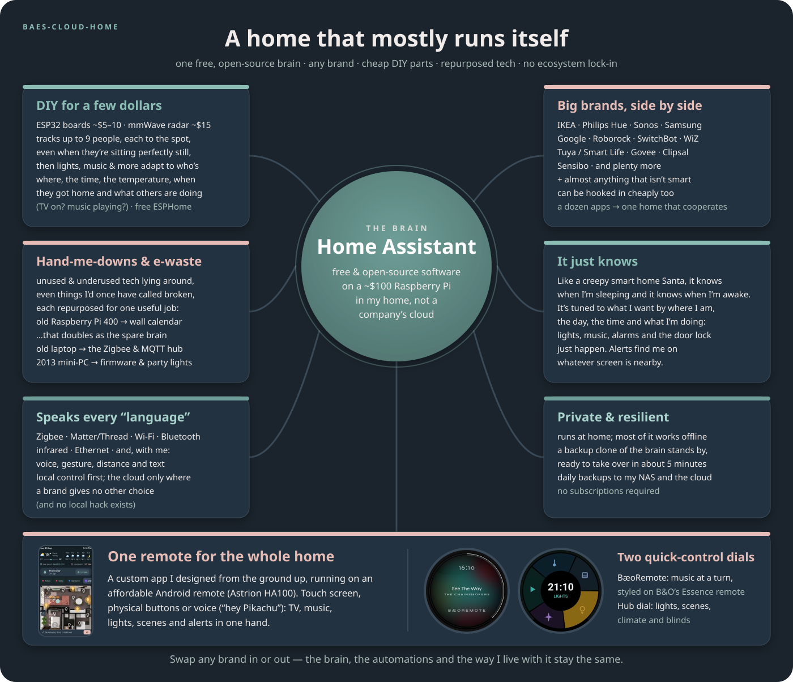

## In plain English

**Home Assistant is free, open-source software** that runs on a small computer in your home and
talks to almost any smart device, from any brand. Instead of a dozen apps that don't talk to each
other, one "brain" sees everything (lights, speakers, TV, door lock, robot vacuums, washing
machine) and makes it all work together.

What makes mine feel like magic is **presence**. Radar sensors that cost about $15 each track up
to nine people around the flat, each to the spot, even when someone is sitting perfectly still.
My phone's location plus Bluetooth tells the house when I've left or come home. Like Santa, it
knows when I'm sleeping and it knows when I'm awake. It has been tuned to what I want based on
where I am, the day, the time and what I'm doing. So the lights follow me, the music follows me,
the door locks behind me (a fingerprint on the keypad lets me back in), the robot vacuums clean
while I'm out, and my alarm reads my work roster so I never set one, or wake up too early (or late)
based on where I am working that day.

Two robot vacuums share the floors. The main one (a Roborock) does a full clean once I've been gone
ten minutes. My old, cheap one (a Lubluelu SL68 that still works fine) then does a final quick sweep
if the main one finished without a problem, or does a full clean if the Roborock gets stuck behind
a closed door, or caught on something I left on the floor.

When friends are over, **party mode** pauses the automations that would be annoying or make no
sense with a crowd: lights reacting to people walking past, scenes changing, the door locking itself
and announcing it, away mode and the robots. It nags/reminds me at 10 am if I have left it on.

The sensors I built are hidden in plain sight: one is in the ceiling under a standard downlight
cover, one sits on a wall behind a canvas artwork, and one is on a shelf inside a display box.

**Dashboards, my former love.** Historically I was heavily dashboard-focused, spending hours a
week tweaking and perfecting highly custom dashboards that ran on screens in every room. Now I
use **one remote**: an app I designed from the ground up, running on an affordable Android remote,
that controls the whole home by touch screen, button press or voice ("hey Pikachu"). There are
also two round knob screens I built, and alerts that pop up on whatever screen is nearby.

**Nothing is locked to one company.** IKEA, Philips Hue, Sonos, Samsung, Google, Tuya/Smart Life
and others sit side by side with $5 DIY boards, and almost anything that isn't smart can be
hooked in cheaply. Unused and "broken" gadgets got a second life doing one specific job each: an
old Raspberry Pi 400 became my wall calendar *and* a backup clone of the brain that takes over if
the main one dies, an ex-business laptop became my own local private cloud and Zigbee hub, and a
QNAP NAS i got cheap second hand that was declared end-of-life now runs Unraid as my media server. 
Most of it keeps working without the internet, and most of it isn't allowed to talk to the internet.

**It keeps getting better.** Whenever I reach the end of my week with some Claude credits left over,
Claude reviews the error logs and looks for efficiencies, new approaches, and better or new ways to
use what's already here, so everything stays in line.

## What it does

| | |
|---|---|
| [**1 · Presence**](docs/01-presence.md) | Three radars fused onto my floorplan (up to 9 people), still-person detection, Bluetooth + GPS that must agree before I'm "away" |
| [**2 · Mornings**](docs/02-mornings-and-work-alarm.md) | Alarms worked out from my work calendar, whole-house Sonos, a morning briefing and the news |
| [**3 · Leaving & coming home**](docs/03-leaving-and-coming-home.md) | Lock up, lights off, robots clean, intruder alerts, a fingerprint keypad (with backups) to get back in |
| [**4 · One remote & popups everywhere**](docs/04-popups-on-every-screen.md) | My own remote app, two knobs, a wall board, phone and speakers all show the same state |
| [**5 · Voice: "hey Pikachu"**](docs/05-voice-hey-pikachu.md) | A custom wake word on a voice box and my remotes, local commands first |
| [**6 · Media**](docs/06-media-and-sonos.md) | Music follows me, the TV takes over the Sonos, a B&O-style music knob |
| [**7 · Safety nets**](docs/07-safety-nets.md) | Leaks, weather warnings, radar ghosts, lost speakers, the Pi's own health |
| [**8 · Failover**](docs/08-failover-and-infrastructure.md) | A backup clone on the wall-calendar Pi takes over in ~5 minutes |
| [**9 · Rebuild from scratch**](docs/09-rebuild-from-scratch.md) | Every add-on, HACS component, integration and step, in order |
| [**10 · Lessons learned**](docs/10-lessons-learned.md) | What I'd tell anyone starting out |
| [Hardware](docs/hardware.md) | Everything in the flat, from $5 boards to the TV |

## A day with it

| When | What happens, without me doing anything |
|---|---|
| ~70 min before my shift | Every speaker plays my alarm, the lights fade up, and the alarm pops up on the remote, the knob and my phone |
| Out of bed | Morning lights, TV on with the news |
| First bathroom visit | The speaker reads today's calendar and a news digest, then joins the lounge |
| Walking around | Lights come on ahead of me and go off behind me; music follows me (if I want it) |
| Leaving | Door locks, lights and media go off, away mode arms, robots start cleaning |
| While I'm out | Radar intruder alert, door alerts, and the camera (only on while I'm away) sends clips described by AI |
| Coming home | A fingerprint on the keypad lets me in, with a hands-free unlock as backup; away mode switches off |
| Evening | Sunset and 9 pm scenes, sofa + TV lights, night sound on the TV |
| Falling asleep on the sofa | Everything turns off |
| 2 am | A dim path lights the way to the bathroom and the kitchen, and switches off once I'm back in bed |

## See it

**Presence on the floorplan.** An illustrative mock-up built from my real zones and radar
positions: the 2 am run (bed → ensuite → bathroom → wardrobe → kitchen for a drink → back to bed through the real doorways), then the kitchen lights in the day.


**The one remote, the knobs and the wall board**

| The one remote (my own app) | BæoRemote music knob | Bedroom hub knob | Wall board (old Pi 400) |
|---|---|---|---|
| 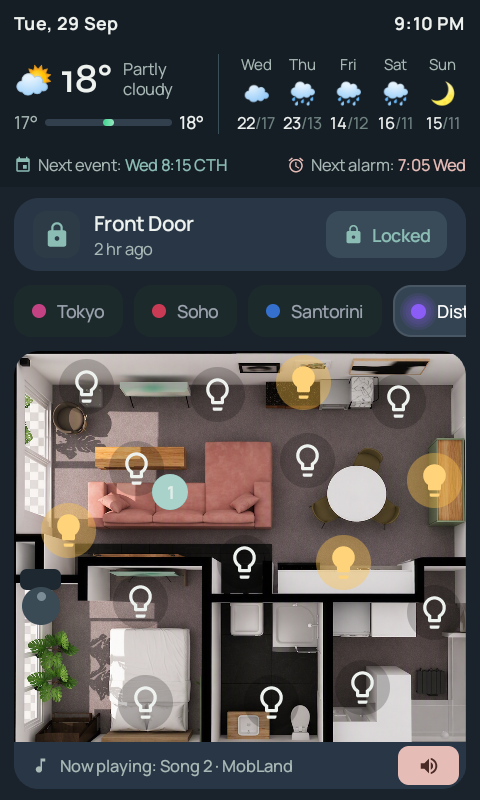 | 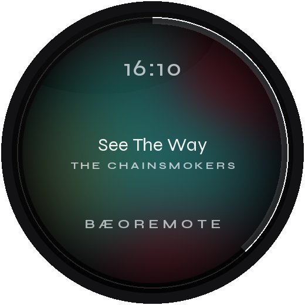 | 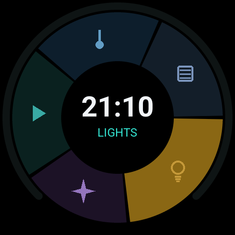 | 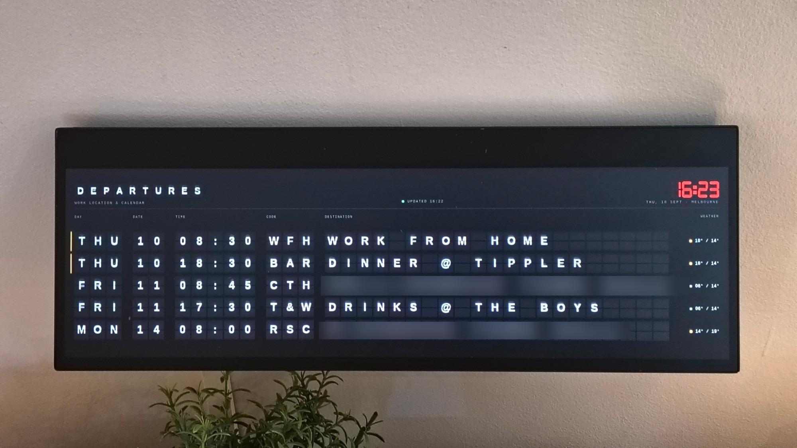 |
| 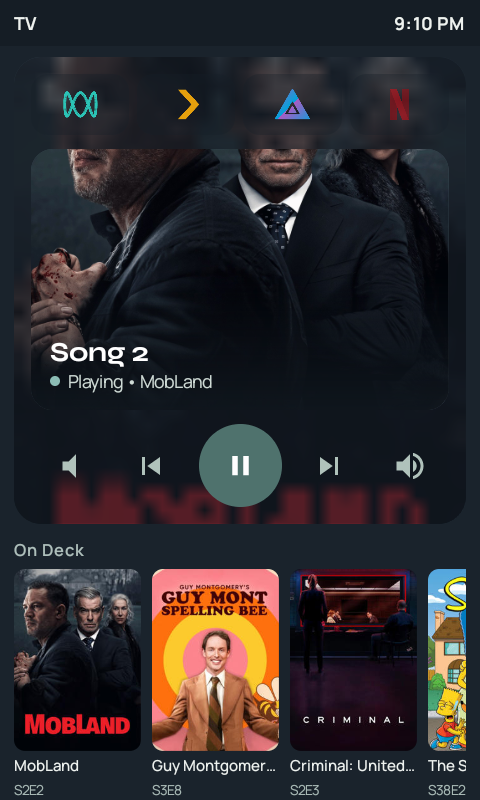 | 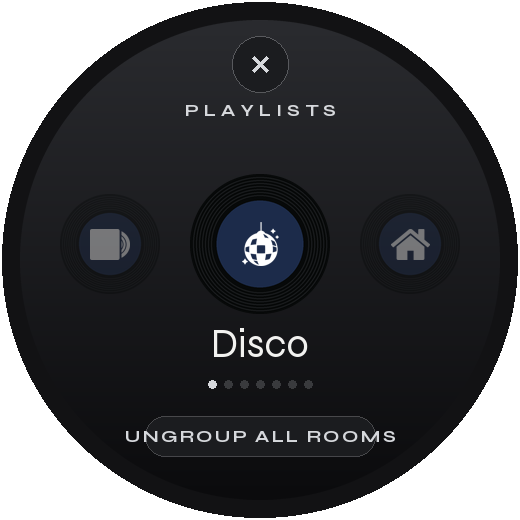 | 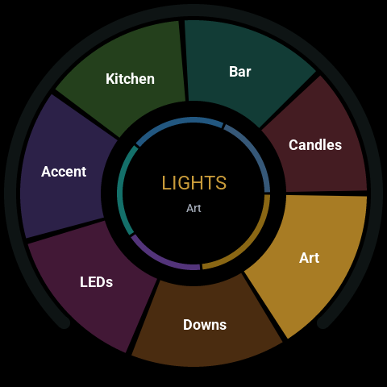 |  |

**Popups wherever I am**

| Washer done | Alarm on the remote | Alarm on a knob |
|---|---|---|
| 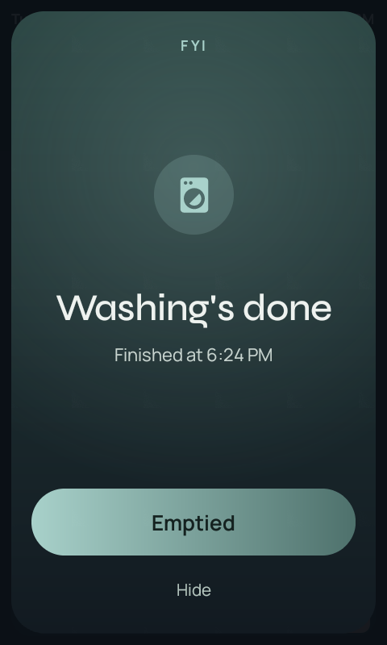 | 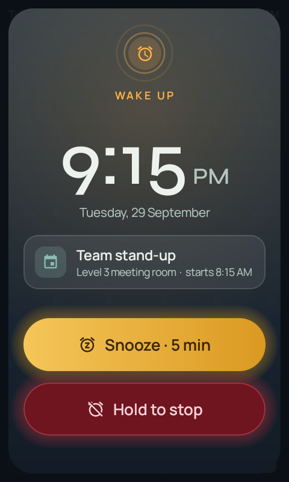 | 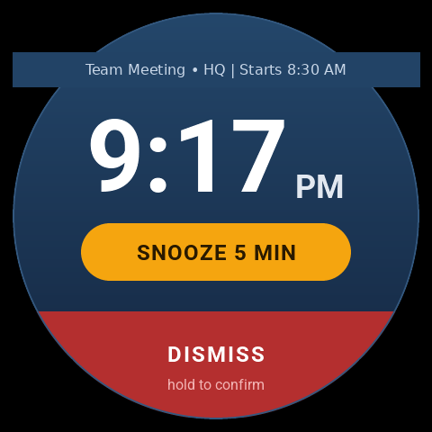 |

## How it's wired

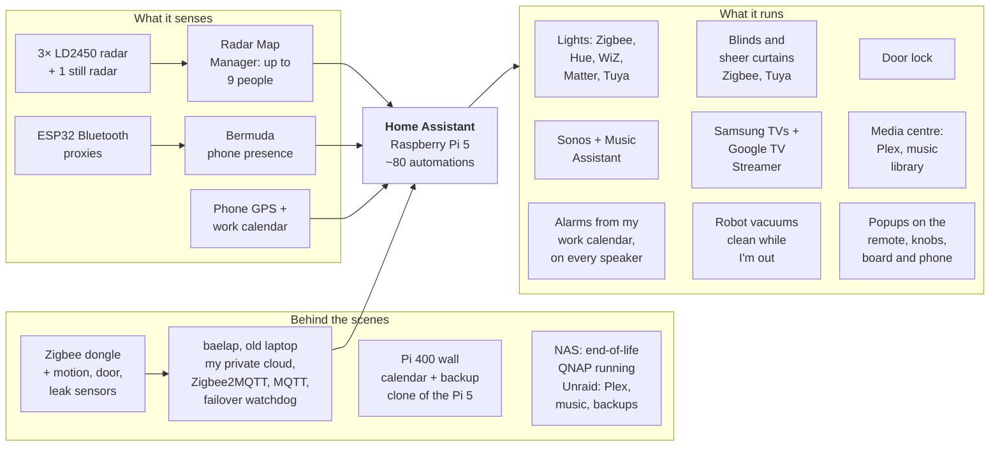

## What's in this repo

```
config/            the real config, scrubbed of private details (copy into /config to rebuild)
  configuration.yaml, automations.yaml, scripts.yaml, scenes.yaml
  packages/        work alarms, front door, presence, news digest, rotary lists
  helpers/         helpers I made in the UI, exported as YAML
  esphome/         ESPHome devices (secrets.example.yaml shows what to fill in)
  rmm/             Radar Map Manager zones and radar positions
docs/              the write-up, one topic per page
images/            screenshots, the floorplan, the infographic and the radar demo
tools/             make_rmm_gif.py (regenerates the radar demo) + the fonts it uses (OFL)
```

## Related projects
- [astrion-dashboard](https://github.com/baes-cloud/astrion-dashboard): the one remote, my from-scratch app for the Astrion HA100
- [baeoremote](https://github.com/baes-cloud/baeoremote): BæoRemote, the B&O Essence-style music knob
- [esp-rotary-display-ha-hub](https://github.com/baes-cloud/esp-rotary-display-ha-hub): the whole-home hub knob
- [rpi-departure-board](https://github.com/baes-cloud/rpi-departure-board): the split-flap wall calendar

## Privacy
Everything here was scrubbed before publishing: IP addresses, keys, passwords, emails, NFC tag
IDs, device IDs and location details are replaced with placeholders like `<nas-ip>`,
`<device-ip>` and `!secret ota_password`. If you spot something that slipped through, please open an issue.
