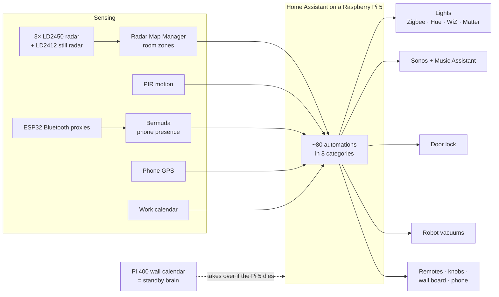

# A home that mostly runs itself

My [Home Assistant](https://www.home-assistant.io) setup: one apartment, about 180 devices
from a dozen brands, plus cheap DIY sensors and hand-me-down hardware. It's all tuned so I
hardly ever have to touch anything.


## In plain English

**Home Assistant is free, open-source software** that runs on a small computer in your home and
talks to almost any smart device from any brand. Instead of a dozen apps that don't talk to each
other, there's one "brain" that sees everything (lights, speakers, TV, door lock, robot vacuums,
washing machine) and makes it all work together around you.

What makes mine feel like magic is **presence**. Radar sensors that cost about $15 each know which
room I'm in, even when I'm sitting perfectly still, and my phone's location plus Bluetooth tells the
house when I've left or come home. So the lights follow me, the music follows me, the door locks
behind me and opens when I get back, the robot vacuums clean while I'm out, and my alarm reads my
work roster so I never set one.

**I don't use dashboards.** Day to day I use a remote with a screen (for TV and the odd ad-hoc
thing), two little knob displays I built, my voice ("hey Pikachu"), and alerts that pop up on
whatever screen is nearby.

**Nothing is locked to one company.** IKEA, Philips Hue, Sonos, Samsung, Google and others sit side
by side with $5 DIY boards. An old Raspberry Pi 400 became my wall calendar *and* a spare brain that
takes over if the main one dies, and most of it keeps working without the internet.

## What it does

| | |
|---|---|
| [**1 · Presence**](docs/01-presence.md) | Three radars fused onto my floorplan, still-person detection, Bluetooth + GPS that must agree before I'm "away" |
| [**2 · Mornings**](docs/02-mornings-and-work-alarm.md) | Alarms worked out from my work calendar, whole-house Sonos, a morning briefing and the news |
| [**3 · Leaving & coming home**](docs/03-leaving-and-coming-home.md) | Lock up, lights off, robots clean, intruder alerts, the door opens as I arrive |
| [**4 · Popups on every screen**](docs/04-popups-on-every-screen.md) | One state shown on remotes, knobs, wall board, phone and speakers. No dashboards |
| [**5 · Voice: "hey Pikachu"**](docs/05-voice-hey-pikachu.md) | Custom wake word on a voice box and my remotes, local commands first |
| [**6 · Media**](docs/06-media-and-sonos.md) | Music follows me, the TV takes over the Sonos, Plex tidies up after itself |
| [**7 · Safety nets**](docs/07-safety-nets.md) | Leaks, weather warnings, radar ghosts, lost speakers, the Pi's own health |
| [**8 · Failover**](docs/08-failover-and-infrastructure.md) | The wall-calendar Pi takes over in ~5 min if the main one dies |
| [**9 · Rebuild from scratch**](docs/09-rebuild-from-scratch.md) | Every add-on, HACS component, integration and step, in order |
| [**10 · Lessons learned**](docs/10-lessons-learned.md) | What I'd tell anyone starting out |
| [Hardware](docs/hardware.md) | Everything in the flat, from $5 boards to the TV |

## A day with it

| When | What happens, without me doing anything |
|---|---|
| ~70 min before my shift | Every speaker plays my alarm; lights fade up; the alarm pops up on the remote, the knob and my phone |
| Out of bed | Morning lights, TV on with the news |
| First bathroom visit | The speaker reads today's calendar and a news digest, then joins the lounge |
| Walking around | Lights come on ahead of me and go off behind me; music follows me (if I want it) |
| Leaving | Door locks, lights and media go off, away mode arms, robots start cleaning |
| While I'm out | Radar intruder alert, camera clips described by AI, door alerts |
| Coming home | The door unlocks as I walk up; "Welcome home" over the speakers |
| Evening | Sunset and 9 pm scenes, sofa + TV lights, night sound on the TV |
| Falling asleep on the sofa | Everything turns off |
| 2 am | A dim path to the bathroom, off once I'm back in bed |

## See it

**Presence on the floorplan** (illustrative mock-up of the night path and kitchen lights,
built from my real zones and radar positions):


**The things I actually touch**

| Remote (my own app) | Rotary knob | Wall board (old Pi 400) |
|---|---|---|
|  |  |  |
|  |  |  |

**Popups wherever I am**

| Washer done | Alarm on the remote | Alarm on the knob |
|---|---|---|
|  |  |  |

## How it's wired



## What's in this repo

```
config/            the real config, scrubbed of private details (copy into /config to rebuild)
  configuration.yaml, automations.yaml, scripts.yaml, scenes.yaml
  packages/        work alarms, front door, presence, news digest, rotary lists
  helpers/         helpers I made in the UI, exported as YAML
  esphome/         ESPHome devices (secrets.example.yaml shows what to fill in)
  rmm/             Radar Map Manager zones and radar positions
docs/              the write-up, one topic per page
images/            screenshots, the floorplan and the radar demo
tools/             make_rmm_gif.py (regenerates the radar demo)
```

## Related projects
- [astrion-dashboard](https://github.com/baes-cloud/astrion-dashboard): my replacement app for the Astrion remotes
- [esp-rotary-display-ha-hub](https://github.com/baes-cloud/esp-rotary-display-ha-hub): the round rotary knob displays
- [rpi-departure-board](https://github.com/baes-cloud/rpi-departure-board): the split-flap wall calendar

## Privacy
Everything here was scrubbed before publishing: IP addresses, keys, passwords, emails, NFC tag
IDs, device IDs and location details are replaced with placeholders like `<nas-ip>`,
`<device-ip>` and `!secret ota_password`. If you spot something that slipped through, please open an issue.
