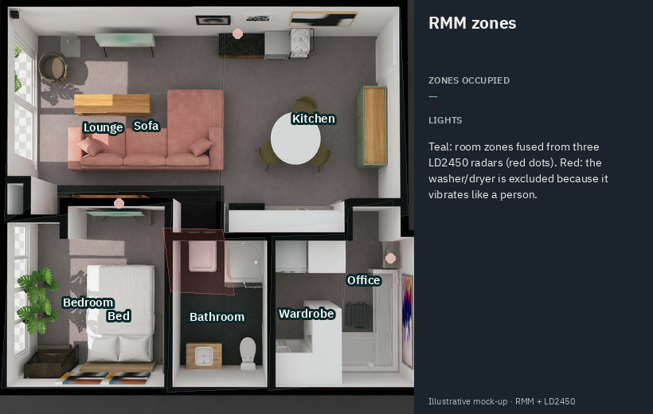
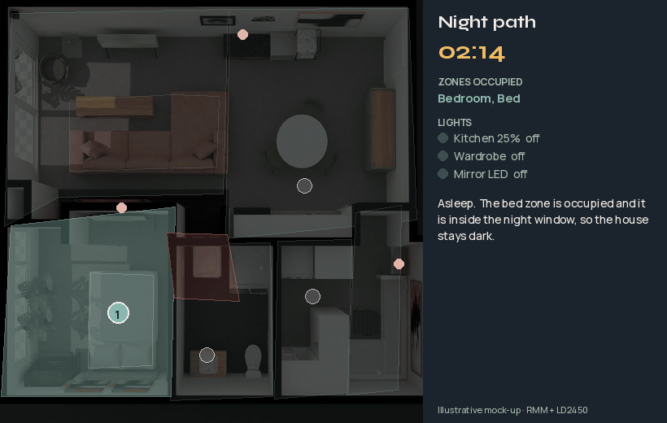
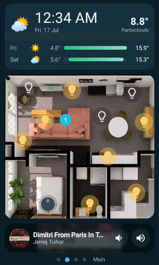

# 1 · Presence: radar, Bluetooth and GPS

Everything else in this house hangs off one question: **where am I, and what am I doing?**
Motion sensors can't answer it on their own: they forget you the moment you sit still. So
the house combines four kinds of sensing, each covering the others' blind spots.

| Layer | Hardware | What it's good at | What it's bad at |
|---|---|---|---|
| **mmWave radar (LD2450)** | 3 radars: an Apollo R PRO-1 plus two DIY ESP32 + LD2450 boards (~$15 radar each) | Each tracks up to 3 people with x/y position, so up to **9 people** across the flat | Can lose a perfectly still person; sees robot vacuums and vibrating washers as people |
| **"Still" radar (LD2412)** | Built into the Apollo | Picks up breathing and micro-movement on the sofa | No position, just "someone is there" |
| **PIR motion** | IKEA VALLHORN, Xiaomi, a Sonoff SNZB-06P | Instant "someone walked in" | Times out on people sitting still |
| **Bluetooth (BLE)** | ESP32 Bluetooth proxies around the flat + my phone's beacon, via **Bermuda** | "My phone is in the flat" (and roughly which room) | Phones put beacons to sleep; BLE alone can be spoofed |
| **GPS** | Home Assistant Companion app | "I'm actually away from home" | Slow and fuzzy near home |

The radars I built are hidden in plain sight: one is in the ceiling under a standard downlight
cover, one sits on a wall behind a canvas artwork, and one is on a shelf inside a display box.
mmWave radar sees straight through fabric, canvas and thin plastic.

## Radar Map Manager: one map from three radars

[Radar Map Manager](https://github.com/Moe8383/radar_map_manager) (a HACS integration) puts all
three LD2450s onto my floorplan, merges the same person seen by two radars into one target,
smooths the tracks, and turns zones I've drawn into ordinary Home Assistant sensors:

- **Room zones:** lounge, kitchen, office, wardrobe, bathroom, bedroom, plus a *sofa* and a *bed* zone
- **Stationary zones:** the bed (holds for an hour), the sofa and the shower, where "not moving" is expected
- **Exclude zone:** the washer/dryer (it vibrates exactly like a person)
- **Entrance zone:** the front door

Each zone becomes `binary_sensor.rmm_default_<zone>_occupancy` plus a people count, and
`sensor.rmm_default_master` counts everyone in the flat.



**What it looks like in practice** (an illustrative mock-up built from my real zones and
radar positions; the generator is in [`tools/make_rmm_gif.py`](../tools/make_rmm_gif.py)):



And the real thing, live on the remote:



The exported map (zones, radar positions, tracking settings) is in
[`config/rmm/radar_map_manager.json`](../config/rmm/radar_map_manager.json).

## The pattern every room light uses

> **PIR turns it on instantly. Radar keeps it on while you're still there. A sweep cleans up.**

```yaml
- id: '1785400000003'
  alias: 'RMM: Kitchen presence light'
  description: PIR instant-on (kitchen_motion, physically moved back to the kitchen
    2026-07-25) + radar-zone hold. Created by Claude 2026-07-25.
  triggers:
  - trigger: state
    entity_id:
    - binary_sensor.kitchen_motion
    to: 'on'
    id: 'on'
  - trigger: state
    entity_id: binary_sensor.rmm_default_kitchen_occupancy
    to: 'on'
    id: 'on'
  - trigger: state
    entity_id: binary_sensor.rmm_default_kitchen_occupancy
    to: 'off'
    for: 00:03:00
    id: 'off'
  conditions:
  - alias: Auto-stay is off (party mode suspends this)
    condition: state
    entity_id: input_boolean.auto_stay
    state: 'off'
  actions:
  - choose:
    - conditions:
      - condition: trigger
        id: 'on'
      - condition: template
        value_template: '{{ not ((d in [6,0,1,2,3] and t >= 21*60) or (d in [0,1,2,3,4] and t <
          7*60) or (d in [4,5] and t >= 23*60) or (d in [5,6] and t < 9*60)) }}'
      sequence:
      - action: light.turn_on
        data: {}
        target:
          entity_id: light.kitchen_group
    - conditions:
      - condition: trigger
        id: 'off'
      - condition: state
        entity_id: binary_sensor.kitchen_motion
        state: 'off'
      sequence:
      - action: light.turn_off
        target:
          entity_id:
          - light.kitchen_group
        data: {}
  mode: restart
```

The **night path** is the same idea at 2 am. The bathroom opens off the bedroom and into the
wardrobe, which opens into the kitchen. So getting up for the bathroom, then going out through the
wardrobe to the kitchen for a drink, follows exactly the route the automation lights, dimly:
mirror LED, wardrobe, kitchen at 25%. Back across the lounge to bed, it all goes off two minutes
later. That's the walk in the animation above.

<details><summary><b>RMM: Night path to bathroom</b> (click to expand)</summary>

```yaml
- id: '1785400000002'
  alias: 'RMM: Night path to bathroom'
  description: Getting up at night lights a dim kitchen->wardrobe->bathroom path;
    back in bed/sofa 2 min (or path empty 4 min) turns it off. Created by Claude 2026-07-25.
  triggers:
  - trigger: state
    entity_id: binary_sensor.kitchen_motion
    to: 'on'
    id: path
  - trigger: state
    entity_id: binary_sensor.bathroom_occupancy_sonoff_snzb_06p
    to: 'on'
    id: path
  - trigger: state
    entity_id:
    - binary_sensor.rmm_default_kitchen_occupancy
    - binary_sensor.rmm_default_wardrobe_occupancy
    - binary_sensor.rmm_default_bathroom_occupancy
    to: 'on'
    id: path
  - trigger: state
    entity_id:
    - binary_sensor.rmm_default_bed_occupancy
    - binary_sensor.rmm_default_sofa_occupancy
    to: 'on'
    for: 00:02:00
    id: return
  - trigger: state
    entity_id:
    - binary_sensor.rmm_default_kitchen_occupancy
    - binary_sensor.rmm_default_wardrobe_occupancy
    - binary_sensor.rmm_default_bathroom_occupancy
    to: 'off'
    for: 00:04:00
    id: away
  conditions:
  - alias: Auto-stay is off (party mode suspends this)
    condition: state
    entity_id: input_boolean.auto_stay
    state: 'off'
  - condition: template
    value_template: '{{ (d in [6,0,1,2,3] and t >= 21*60) or (d in [0,1,2,3,4] and t < 7*60) or
      (d in [4,5] and t >= 23*60) or (d in [5,6] and t < 9*60) }}'
  actions:
  - choose:
    - conditions:
      - condition: trigger
        id: path
      sequence:
      - action: light.turn_on
        target:
          entity_id: light.kitchen
        data:
          brightness_pct: 25
      - action: light.turn_on
        target:
          entity_id:
          - light.wardrobe
      - action: light.turn_on
        data:
          brightness_pct: 40
        target:
          entity_id: light.send_nudes
      - action: light.turn_on
        metadata: {}
        target:
          entity_id: light.wardrobes
        data: {}
      - alias: WiZ mirror LED last, and only if reachable (pywizlight errors abort
          the run)
        if:
        - condition: template
          value_template: '{{ states(''light.bathroom_mirror_led'') not in [''unavailable'',
            ''unknown''] }}'
        then:
        - action: light.turn_on
          metadata: {}
          data: {}
          target:
            entity_id: light.bathroom_mirror_led
          continue_on_error: true
    - conditions:
      - condition: or
        conditions:
        - condition: trigger
          id: return
        - condition: trigger
          id: away
      - condition: state
        entity_id: binary_sensor.rmm_default_kitchen_occupancy
        state: 'off'
      - condition: state
        entity_id: binary_sensor.rmm_default_wardrobe_occupancy
        state: 'off'
      - condition: state
        entity_id: binary_sensor.rmm_default_bathroom_occupancy
        state: 'off'
      sequence:
      - action: light.turn_off
        target:
          entity_id:
          - light.kitchen
          - light.wardrobe
          - light.send_nudes
        data: {}
      - alias: WiZ mirror LED last, and only if reachable
        if:
        - condition: template
          value_template: '{{ states(''light.bathroom_mirror_led'') not in [''unavailable'',
            ''unknown''] }}'
        then:
        - action: light.turn_off
          target:
            entity_id: light.bathroom_mirror_led
          data: {}
          continue_on_error: true
  mode: restart
```

</details>


### Sitting still on the sofa
The LD2450 occasionally "loses" someone who hasn't moved for a long time. The Apollo's
second radar (LD2412) detects breathing, so a template helper holds the sofa as occupied
while *either* radar still sees me. That keeps the couch lights on during a film, and it
also feeds the "fell asleep" detection that turns everything off.

<details><summary><b>RMM: Fell asleep - all lights off</b> (click to expand)</summary>

```yaml
- id: '1785400000001'
  alias: 'RMM: Fell asleep - all lights off'
  description: 'Asleep detection: sofa = Apollo radar sees zero movement for 45 min
    (observed 22.5-min awake-stillness stretches, so 25 was too tight) while the sofa
    zone is occupied (fidgeting while watching TV resets the timer, so night lights
    stay on); bed = bed zone occupied 20 min. Night window + other zones empty + guest
    mode off. UPDATED 2026-08-11: added the Apollo LD2412 in tandem. The sofa branch
    now accepts EITHER the RMM sofa zone OR the LD2412 still_target, because the RMM
    zone rests on stationary_max_hold (a 3450 s timer) and collapses if the LD2450
    loses a motionless sleeper - which strands the lights on all night. The LD2412
    detects micro-motion/breathing, so it is evidence rather than a timer. A 45-min
    quiet period on EITHER radar can now trigger. Strictly additive: every case that
    fired before still fires.'
  triggers:
  - trigger: state
    entity_id: binary_sensor.club_apollo_r_pro_1_ld2450_moving_target
    to: 'off'
    for: 00:45:00
    id: sofa
  - trigger: state
    entity_id: binary_sensor.rmm_default_bed_occupancy
    to: 'on'
    for: 00:20:00
    id: bed
  - trigger: state
    entity_id: binary_sensor.club_apollo_r_pro_1_ld2412_moving_target
    to: 'off'
    for: 00:45:00
    id: sofa
  conditions:
  - alias: Auto-stay is off (party mode suspends this)
    condition: state
    entity_id: input_boolean.auto_stay
    state: 'off'
  - condition: template
    value_template: '{{ (d in [6,0,1,2,3] and t >= 21*60) or (d in [0,1,2,3,4] and t < 7*60) or
      (d in [4,5] and t >= 23*60) or (d in [5,6] and t < 9*60) }}'
  - condition: state
    entity_id: binary_sensor.rmm_default_kitchen_occupancy
    state: 'off'
  - condition: state
    entity_id: binary_sensor.rmm_default_office_occupancy
    state: 'off'
  - condition: state
    entity_id: binary_sensor.rmm_default_wardrobe_occupancy
    state: 'off'
  - condition: state
    entity_id: binary_sensor.rmm_default_bathroom_occupancy
    state: 'off'
  - condition: state
    entity_id: input_boolean.guest_mode
    state: 'off'
  actions:
  - choose:
    - conditions:
      - condition: trigger
        id: sofa
      - condition: or
        conditions:
        - condition: state
          entity_id: binary_sensor.rmm_default_sofa_occupancy
          state: 'on'
        - condition: state
          entity_id: binary_sensor.club_apollo_r_pro_1_ld2412_still_target
          state: 'on'
      sequence:
      - action: light.turn_off
        target:
          entity_id: all
    - conditions:
      - condition: trigger
        id: bed
      sequence:
      - action: light.turn_off
        target:
          entity_id: all
  mode: single
```

</details>


### Respecting manual changes
If I switch a light by hand (app, remote, voice), the automations leave that light alone
until 6 am. The trick is to check **`context.user_id`**, not `parent_id`: time-triggered
automations also have no parent, which made the first version lock lights by mistake.

<details><summary><b>RMM: Light override tracker</b> (click to expand)</summary>

```yaml
- id: '1785400000020'
  alias: 'RMM: Light override tracker'
  description: 'A light turned off/on BY A HUMAN (context.user_id set - UI, app or
    voice) locks or unlocks that light for automation. Uses user_id, NOT parent_id:
    time-triggered automations (the sweeper, the 21:00 scene) also have parent_id=None
    and were false-locking lights. Reset daily 06:00.'
  triggers:
  - trigger: state
    entity_id:
    - light.couch
    - light.club_accent_lights
    - light.club_art_pendants
    - light.club_led_group
    to: 'off'
    id: manual_off
  - trigger: state
    entity_id:
    - light.couch
    - light.club_accent_lights
    - light.club_art_pendants
    - light.club_led_group
    to: 'on'
    id: manual_on
  conditions:
  - condition: template
    value_template: '{{ trigger.to_state.context.user_id is not none }}'
  actions:
  - choose:
    - conditions:
      - condition: trigger
        id: manual_off
      sequence:
      - action: input_boolean.turn_on
        target:
          entity_id: '{{ m[trigger.entity_id] }}'
    - conditions:
      - condition: trigger
        id: manual_on
      sequence:
      - action: input_boolean.turn_off
        target:
          entity_id: '{{ m[trigger.entity_id] }}'
  mode: queued
  max: 10
```

</details>


### Safety nets
Reloading automations wipes any pending `for:` timers, which can strand a light on. A sweep
every 5 minutes turns off any presence light whose zone has been empty past its hold time.

<details><summary><b>RMM: Zone-empty sweep</b> (click to expand)</summary>

```yaml
- id: '1785400000023'
  alias: 'RMM: Zone-empty sweep'
  description: 'Safety net every 5 min: any presence light still on while its zone
    has been empty past its hold time gets turned off. Exists because automation reloads
    wipe pending ''for:'' timers, which can strand lights on. Daytime only - night
    lighting is owned by the path/sleep/scene automations. Created by Claude 2026-07-25.
    The sofa branch also requires the lounge zone to be clear, because the club lights
    serve the whole lounge/sofa area. Office branch is business-hours aware (25 min
    hold Mon-Fri 08:00-18:00) and requires the desk PIR to be off. Sofa presence now
    comes from binary_sensor.sofa_occupied_held (RMM sofa, held while the LD2412 still
    sees someone after RMM loses a still person), so sitting still no longer turns
    the couch lights off. Changed by Claude 2026-10-04.'
  triggers:
  - trigger: time_pattern
    minutes: /5
  conditions:
  - alias: Auto-stay is off (party mode suspends this)
    condition: state
    entity_id: input_boolean.auto_stay
    state: 'off'
  - condition: template
    value_template: '{{ not ((d in [6,0,1,2,3] and t >= 21*60) or (d in [0,1,2,3,4] and t < 7*60)
      or (d in [4,5] and t >= 23*60) or (d in [5,6] and t < 9*60)) }}'
  - condition: state
    entity_id: input_boolean.away_mode
    state: 'off'
  actions:
  - choose:
    - conditions:
      - condition: template
        value_template: '{{ is_state(''binary_sensor.rmm_default_kitchen_occupancy'',''off'')
          and (now() - states.binary_sensor.rmm_default_kitchen_occupancy.last_changed).total_seconds()
          > 180 }}'
      - condition: template
        value_template: '{{ is_state(''light.kitchen'',''on'') or is_state(''light.kitchen_art'',''on'')
          }}'
      - condition: state
        entity_id: binary_sensor.kitchen_motion
        state: 'off'
      sequence:
      - action: light.turn_off
        target:
          entity_id:
          - light.kitchen
        data: {}
  - choose:
    - conditions:
      - condition: template
        value_template: '{{ is_state(''binary_sensor.rmm_default_office_occupancy'',''off'')
          and (now() - states.binary_sensor.rmm_default_office_occupancy.last_changed).total_seconds()
          > lim }}'
      - condition: state
        entity_id: binary_sensor.office_motion
        state: 'off'
      - condition: template
        value_template: '{{ is_state(''light.office_only'',''on'') }}'
      sequence:
      - action: light.turn_off
        target:
          entity_id:
          - light.office_only
  - choose:
    - conditions:
      - condition: template
        value_template: '{{ is_state(''binary_sensor.rmm_default_wardrobe_occupancy'',''off'')
          and (now() - states.binary_sensor.rmm_default_wardrobe_occupancy.last_changed).total_seconds()
          > 120 }}'
      - condition: template
        value_template: '{{ is_state(''light.wardrobe'',''on'') }}'
      sequence:
      - action: light.turn_off
        target:
          entity_id:
          - light.wardrobe
  - choose:
    - conditions:
      - condition: template
        value_template: '{{ is_state(''binary_sensor.rmm_default_bathroom_occupancy'',''off'')
          and (now() - states.binary_sensor.rmm_default_bathroom_occupancy.last_changed).total_seconds()
          > 120 }}'
      - condition: template
        value_template: '{{ is_state(''light.bathroom_mirror_led'',''on'') or is_state(''light.bathroom_downlights'',''on'')
          }}'
      - condition: state
        entity_id: binary_sensor.bathroom_occupancy_sonoff_snzb_06p
        state: 'off'
      sequence:
      - action: light.turn_off
        target:
          entity_id:
          - light.bathroom_mirror_led
          - light.bathroom_downlights
  - choose:
    - conditions:
      - condition: template
        value_template: '{{ is_state(''binary_sensor.rmm_default_bedroom_occupancy'',''off'')
          and (now() - states.binary_sensor.rmm_default_bedroom_occupancy.last_changed).total_seconds()
          > 300 }}'
      - condition: template
        value_template: '{{ is_state(''light.bedroom_cupboard_light_3'',''on'') or
          is_state(''light.bedroom_cupboard_light_2'',''on'') or is_state(''light.bedlamps'',''on'')
          }}'
      sequence:
      - action: light.turn_off
        target:
          entity_id:
          - light.bedroom_cupboard_light_3
          - light.bedroom_cupboard_light_2
          - light.bedlamps
  - choose:
    - conditions:
      - condition: template
        value_template: '{{ is_state(''binary_sensor.rmm_default_lounge_occupancy'',''off'')
          and (now() - states.binary_sensor.rmm_default_lounge_occupancy.last_changed).total_seconds()
          > 300 }}'
      - condition: template
        value_template: '{{ is_state(''light.kitchen_console_candles'',''on'') }}'
      sequence:
      - action: light.turn_off
        target:
          entity_id:
          - light.kitchen_console_candles
  - choose:
    - conditions:
      - condition: template
        value_template: '{{ is_state(''binary_sensor.sofa_occupied_held'',''off'')
          and (now() - states.binary_sensor.sofa_occupied_held.last_changed).total_seconds()
          > 180 }}'
      - condition: template
        value_template: '{{ is_state(''light.couch'',''on'') or is_state(''light.club_accent_lights'',''on'')
          }}'
      - condition: state
        entity_id: binary_sensor.rmm_default_lounge_occupancy
        state: 'off'
      sequence:
      - action: light.turn_off
        target:
          entity_id:
          - light.couch
          - light.club_accent_lights
  mode: single
```

</details>


Radars sometimes latch onto a "ghost". This one restarts just the radar module (not the ESP)
when it sees a physically impossible target, retries once, and only then asks me for help:

<details><summary><b>RMM: LD2450 ghost auto-recover (long)</b> (click to expand)</summary>

```yaml
- id: '1785400000024'
  alias: 'RMM: LD2450 ghost auto-recover'
  description: 'Restarts a stuck LD2450 radar module when it latches onto a phantom
    target. Three detectors: (A) a target parked within 500mm of the sensor face for
    20 min - physically implausible, this is the observed failure mode; (B) presence
    latched on for 6 h with the moving_target sensor never once flipping - a real
    sleeper twitches, a ghost does not; (C) presence reported while away mode is armed.
    Presses <slug>_radar_restart (restarts the LD2450 module only, not the ESP), retries
    once, then raises a persistent notification rather than looping. Clears RMM''s
    fused copy afterwards. 1 h cooldown per firing. Created by Claude 2026-07-25.'
  triggers:
  - trigger: numeric_state
    entity_id: sensor.ld2450_tracker_target_1_distance
    below: 500
    for: 00:20:00
    id: near_ld2450_tracker
  - trigger: state
    entity_id: binary_sensor.ld2450_tracker_presence
    to: 'on'
    for: 06:00:00
    id: stuck_ld2450_tracker
  - trigger: state
    entity_id: binary_sensor.ld2450_tracker_presence
    to: 'on'
    for: 00:10:00
    id: away_ld2450_tracker
  - trigger: numeric_state
    entity_id: sensor.ld2450_tracker_2_target_1_distance
    below: 500
    for: 00:20:00
    id: near_ld2450_tracker_2
  - trigger: state
    entity_id: binary_sensor.ld2450_tracker_2_presence
    to: 'on'
    for: 06:00:00
    id: stuck_ld2450_tracker_2
  - trigger: state
    entity_id: binary_sensor.ld2450_tracker_2_presence
    to: 'on'
    for: 00:10:00
    id: away_ld2450_tracker_2
  conditions: []
  actions:
  - choose:
    - conditions:
      - condition: trigger
        id: near_ld2450_tracker
      - condition: state
        entity_id: binary_sensor.ld2450_tracker_moving_target
        state: 'off'
      - condition: template
        value_template: '{{ this.attributes.last_triggered is none or (now() - this.attributes.last_triggered).total_seconds()
          > 3600 }}'
      sequence:
      - action: button.press
        target:
          entity_id: button.ld2450_tracker_radar_restart
        continue_on_error: true
      - delay: 00:00:45
      - if:
        - condition: state
          entity_id: binary_sensor.ld2450_tracker_presence
          state: 'on'
        then:
        - action: button.press
          target:
            entity_id: button.ld2450_tracker_radar_restart
          continue_on_error: true
        - delay: 00:00:45
        - if:
          - condition: state
            entity_id: binary_sensor.ld2450_tracker_presence
            state: 'on'
          then:
          - action: persistent_notification.create
            data:
              title: LD2450 ghost stuck
              message: bedroom_tracker still reports a target after two radar restarts.
                It may need an ESPHome reboot or power cycle.
              notification_id: ghost_ld2450_tracker
      - action: radar_map_manager.reset_tracking_history
        data: {}
        continue_on_error: true
    - conditions:
      - condition: trigger
        id: stuck_ld2450_tracker
      - condition: state
        entity_id: binary_sensor.ld2450_tracker_moving_target
        state: 'off'
      - condition: template
        value_template: '{{ this.attributes.last_triggered is none or (now() - this.attributes.last_triggered).total_seconds()
          > 3600 }}'
      - condition: template
        value_template: '{{ (now() - states.binary_sensor.ld2450_tracker_moving_target.last_changed).total_seconds()
          > 21600 }}'
      sequence:
      - action: button.press
        target:
          entity_id: button.ld2450_tracker_radar_restart
        continue_on_error: true
      - delay: 00:00:45
      - if:
        - condition: state
          entity_id: binary_sensor.ld2450_tracker_presence
          state: 'on'
        then:
        - action: button.press
          target:
            entity_id: button.ld2450_tracker_radar_restart
          continue_on_error: true
        - delay: 00:00:45
        - if:
          - condition: state
            entity_id: binary_sensor.ld2450_tracker_presence
            state: 'on'
          then:
          - action: persistent_notification.create
            data:
              title: LD2450 ghost stuck
              message: bedroom_tracker still reports a target after two radar restarts.
                It may need an ESPHome reboot or power cycle.
              notification_id: ghost_ld2450_tracker
      - action: radar_map_manager.reset_tracking_history
        data: {}
        continue_on_error: true
    - conditions:
      - condition: trigger
        id: away_ld2450_tracker
      - condition: template
        value_template: '{{ this.attributes.last_triggered is none or (now() - this.attributes.last_triggered).total_seconds()
          > 3600 }}'
      - condition: state
        entity_id: input_boolean.away_mode
        state: 'on'
      sequence:
      - action: button.press
        target:
          entity_id: button.ld2450_tracker_radar_restart
        continue_on_error: true
      - delay: 00:00:45
      - if:
        - condition: state
          entity_id: binary_sensor.ld2450_tracker_presence
          state: 'on'
        then:
        - action: button.press
          target:
            entity_id: button.ld2450_tracker_radar_restart
          continue_on_error: true
        - delay: 00:00:45
        - if:
          - condition: state
            entity_id: binary_sensor.ld2450_tracker_presence
            state: 'on'
          then:
          - action: persistent_notification.create
            data:
              title: LD2450 ghost stuck
              message: bedroom_tracker still reports a target after two radar restarts.
                It may need an ESPHome reboot or power cycle.
              notification_id: ghost_ld2450_tracker
      - action: radar_map_manager.reset_tracking_history
        data: {}
        continue_on_error: true
    - conditions:
      - condition: trigger
        id: near_ld2450_tracker_2
      - condition: state
        entity_id: binary_sensor.ld2450_tracker_2_moving_target
        state: 'off'
      - condition: template
        value_template: '{{ this.attributes.last_triggered is none or (now() - this.attributes.last_triggered).total_seconds()
          > 3600 }}'
      sequence:
      - action: button.press
        target:
          entity_id: button.ld2450_tracker_2_radar_restart
        continue_on_error: true
      - delay: 00:00:45
      - if:
        - condition: state
          entity_id: binary_sensor.ld2450_tracker_2_presence
          state: 'on'
        then:
        - action: button.press
          target:
            entity_id: button.ld2450_tracker_2_radar_restart
          continue_on_error: true
        - delay: 00:00:45
        - if:
          - condition: state
            entity_id: binary_sensor.ld2450_tracker_2_presence
            state: 'on'
          then:
          - action: persistent_notification.create
            data:
              title: LD2450 ghost stuck
              message: LD2450 Tracker 2 still reports a target after two radar restarts.
                It may need an ESPHome reboot or power cycle.
              notification_id: ghost_ld2450_tracker_2
      - action: radar_map_manager.reset_tracking_history
        data: {}
        continue_on_error: true
    - conditions:
      - condition: trigger
        id: stuck_ld2450_tracker_2
      - condition: state
        entity_id: binary_sensor.ld2450_tracker_2_moving_target
        state: 'off'
      - condition: template
        value_template: '{{ this.attributes.last_triggered is none or (now() - this.attributes.last_triggered).total_seconds()
          > 3600 }}'
      - condition: template
        value_template: '{{ (now() - states.binary_sensor.ld2450_tracker_2_moving_target.last_changed).total_seconds()
          > 21600 }}'
      sequence:
      - action: button.press
        target:
          entity_id: button.ld2450_tracker_2_radar_restart
        continue_on_error: true
      - delay: 00:00:45
      - if:
        - condition: state
          entity_id: binary_sensor.ld2450_tracker_2_presence
          state: 'on'
        then:
        - action: button.press
          target:
            entity_id: button.ld2450_tracker_2_radar_restart
          continue_on_error: true
        - delay: 00:00:45
        - if:
          - condition: state
            entity_id: binary_sensor.ld2450_tracker_2_presence
            state: 'on'
          then:
          - action: persistent_notification.create
            data:
              title: LD2450 ghost stuck
              message: LD2450 Tracker 2 still reports a target after two radar restarts.
                It may need an ESPHome reboot or power cycle.
              notification_id: ghost_ld2450_tracker_2
      - action: radar_map_manager.reset_tracking_history
        data: {}
        continue_on_error: true
    - conditions:
      - condition: trigger
        id: away_ld2450_tracker_2
      - condition: template
        value_template: '{{ this.attributes.last_triggered is none or (now() - this.attributes.last_triggered).total_seconds()
          > 3600 }}'
      - condition: state
        entity_id: input_boolean.away_mode
        state: 'on'
      sequence:
      - action: button.press
        target:
          entity_id: button.ld2450_tracker_2_radar_restart
        continue_on_error: true
      - delay: 00:00:45
      - if:
        - condition: state
          entity_id: binary_sensor.ld2450_tracker_2_presence
          state: 'on'
        then:
        - action: button.press
          target:
            entity_id: button.ld2450_tracker_2_radar_restart
          continue_on_error: true
        - delay: 00:00:45
        - if:
          - condition: state
            entity_id: binary_sensor.ld2450_tracker_2_presence
            state: 'on'
          then:
          - action: persistent_notification.create
            data:
              title: LD2450 ghost stuck
              message: LD2450 Tracker 2 still reports a target after two radar restarts.
                It may need an ESPHome reboot or power cycle.
              notification_id: ghost_ld2450_tracker_2
      - action: radar_map_manager.reset_tracking_history
        data: {}
        continue_on_error: true
  mode: queued
  max: 6
```

</details>


## "Am I home?": GPS and Bluetooth must agree

The house only treats me as *away* when the phone's GPS says I've left **and** the
Bluetooth proxies can't hear my phone. If GPS is unsure, I'm home. That one template sensor
is used by every away/home automation instead of `person.*`:

```yaml
# Presence (moved out of configuration.yaml 2026-10-05).
template:
  - binary_sensor:
      # --- Bae presence: BOTH trackers must agree before anything treats Bae as away.
      # on  = Companion app (GPS) says home, OR Bermuda BLE says home, OR the app's
      #       location is unknown/unavailable (never act "away" without a positive GPS away).
      # off = the Companion app positively says away AND Bermuda BLE does not say home.
      # delay_off swallows brief Bermuda reload blips. Used by every away/home
      # automation instead of person.bae. Added by Claude 2026-09-13.
      - name: Bae home
        unique_id: bae_home_combined
        device_class: presence
        delay_off: "00:00:30"
        state: >-
          
          
          {{ not (gps not in ['home', 'unknown', 'unavailable'] and ble != 'home') }}
        attributes:
          companion_app: "{{ states('device_tracker.motorola_razr_50') }}"
          bermuda_ble: "{{ states('device_tracker.bermuda_razr_bermuda_tracker') }}"
```

On top of that, **away mode** (`input_boolean.away_mode`) only arms when the radars have
also been empty for 15 minutes, because a false "away" at 6 am while I'm asleep is worse
than arming a bit late. It disarms on *any* sign of life, because a false disarm is
harmless and a stuck away mode is not.

<details><summary><b>RMM: Away mode - arm</b> (click to expand)</summary>

```yaml
- id: '1785400000012'
  alias: 'RMM: Away mode - arm'
  description: Arms away mode ONLY when person.bae is not_home AND the Motorola Razr
    is not home AND every radar zone is clear. device_tracker.pixel_6a is deliberately
    EXCLUDED - I leaves that phone at home, so it is not a presence signal. Radar-empty
    alone is NOT sufficient; it loses very still people.
  triggers:
  - trigger: numeric_state
    entity_id: sensor.rmm_default_master
    below: 1
    for: 00:15:00
  - trigger: state
    entity_id: binary_sensor.bae_home
    to: 'off'
    for: 00:05:00
  conditions:
  - alias: Auto-stay is off (party mode suspends this)
    condition: state
    entity_id: input_boolean.auto_stay
    state: 'off'
  - condition: state
    entity_id: input_boolean.away_mode
    state: 'off'
  - condition: state
    entity_id: binary_sensor.bae_home
    state: 'off'
  - condition: not
    conditions:
    - condition: state
      entity_id: device_tracker.motorola_razr_50
      state: home
  - condition: template
    value_template: '{{ expand(''binary_sensor.rmm_default_lounge_occupancy'',''binary_sensor.rmm_default_sofa_occupancy'',''binary_sensor.rmm_default_bed_occupancy'',''binary_sensor.rmm_default_bedroom_occupancy'',''binary_sensor.rmm_default_kitchen_occupancy'',''binary_sensor.rmm_default_office_occupancy'',''binary_sensor.rmm_default_bathroom_occupancy'',''binary_sensor.rmm_default_wardrobe_occupancy'')
      | selectattr(''state'',''eq'',''on'') | list | count == 0 }}'
  actions:
  - action: input_boolean.turn_on
    target:
      entity_id: input_boolean.away_mode
  - action: light.turn_off
    target:
      entity_id: all
  - action: media_player.media_pause
    target:
      entity_id: media_player.club
    continue_on_error: true
  - action: remote.turn_off
    target:
      entity_id: remote.the_club_tvv
    continue_on_error: true
  - action: media_player.turn_off
    target:
      entity_id: media_player.55_the_serif_3
    continue_on_error: true
  - action: climate.turn_off
    target:
      entity_id: climate.aircon
    continue_on_error: true
  - action: radar_map_manager.reset_tracking_history
    data: {}
    continue_on_error: true
  mode: single
```

</details>

<details><summary><b>RMM: Guest mode auto (2+ people → relax the automations)</b> (click to expand)</summary>

```yaml
- id: '1785400000016'
  alias: 'RMM: Guest mode auto'
  description: 2+ radar targets for 10 min -> guest mode on (suppresses sleep lights-off
    and Sonos-follow); back to <=1 for 30 min -> off. Created by Claude 2026-07-25.
  triggers:
  - trigger: numeric_state
    entity_id: sensor.rmm_default_master
    above: 1
    for: 00:10:00
    id: guests
  - trigger: numeric_state
    entity_id: sensor.rmm_default_master
    below: 2
    for: 00:30:00
    id: alone
  conditions: []
  actions:
  - choose:
    - conditions:
      - condition: trigger
        id: guests
      sequence:
      - action: input_boolean.turn_on
        target:
          entity_id: input_boolean.guest_mode
    - conditions:
      - condition: trigger
        id: alone
      sequence:
      - action: input_boolean.turn_off
        target:
          entity_id: input_boolean.guest_mode
  mode: restart
```

</details>


## Robots are people too (to a radar)
A robot vacuum looks exactly like a person to mmWave radar. Whenever a robot runs, the
radar-driven automations are paused and `binary_sensor.roborock_active` ("Robot vacuum
active") tells the intruder alert to ignore the radar. When it docks, a single script
switches everything back on:

<details><summary><b>radar_presence_resume</b> (click to expand)</summary>

```yaml
radar_presence_resume:
  alias: Radar presence · resume after a robot clean
  description: Turns back on the radar-driven automations that a robot-vacuum run
    pauses (the radars see a robot as a person). Used by Roborock · clean while away
    and the SL68 follow-up cleans. Added 2026-10-05.
  mode: single
  icon: mdi:radar
  sequence:
  - action: radar_map_manager.reset_tracking_history
    data: {}
    continue_on_error: true
  - delay: 00:00:20
  - action: automation.turn_on
    target:
      entity_id:
      - automation.rmm_kitchen_presence_light
      - automation.rmm_office_presence_light
      - automation.rmm_wardrobe_presence_light
      - automation.rmm_bedroom_presence_light
      - automation.rmm_bathroom_light_with_shower_hold
      - automation.rmm_couch_light
      - automation.rmm_console_candles
      - automation.rmm_night_path_to_bathroom
      - automation.rmm_fell_asleep_all_lights_off
      - automation.rmm_sonos_follows_you
      - automation.rmm_guest_mode_auto
      - automation.rmm_fall_alert
      - automation.rmm_ambient_day_lights
      - automation.rmm_ld2450_ghost_auto_recover
```

</details>


---
[← Back to the overview](../README.md)
