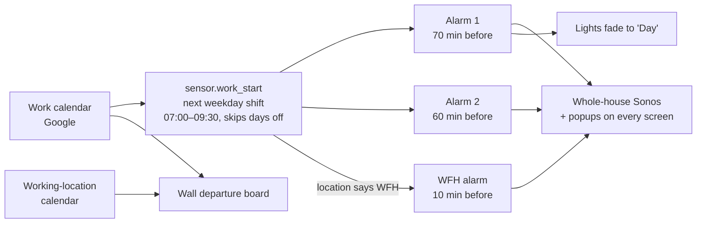
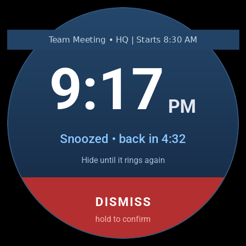
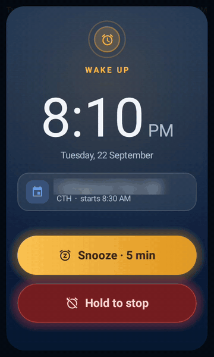
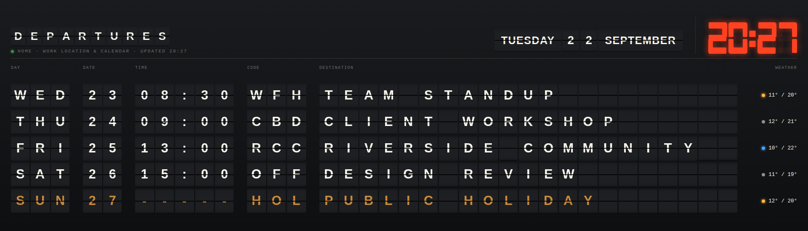

# 2 · Mornings: an alarm that reads my roster

I work shifts. My roster lives in a Google calendar, and the house reads it, so I never set
an alarm.



**The rules**
- Mon–Fri only, and only the day's **first timed event**, and only if it starts between
  07:00 and 09:30. A 1 pm meeting doesn't wake me at 6.
- Never on a day with an all-day RDO / public holiday / leave / "day off" event.
- If the event's title or location says **WFH**, I only get a short alarm 10 minutes before.
- It only rings if I'm actually home.
- Every speaker in the flat joins the lounge speaker, the volume is set *before* playing so
  nothing blasts, alarm 1 plays a radio stream and alarm 2 a random favourite.
- Snooze (5 min), "stop for today", and a self-stop after 10–15 minutes if I ignore it.
- The lights are a **separate automation**, so a light failure can never stop the alarm ringing.

<details><summary><b>The calendar → alarm-time template sensors</b> (click to expand)</summary>

```yaml
template:
  - triggers:
      - trigger: homeassistant
        event: start
      - trigger: event
        event_type: event_template_reloaded
      - trigger: time_pattern
        minutes: "/10"
      # Google Calendar often loads after this template at HA start; refresh as soon as it does.
      - trigger: template
        value_template: "{{ states('calendar.work') not in ['unavailable', 'unknown'] }}"
    conditions:
      - condition: template
        value_template: "{{ states('calendar.work') not in ['unavailable', 'unknown'] }}"
    actions:
      - action: calendar.get_events
        target:
          entity_id: calendar.work
        data:
          start_date_time: "{{ today_at('00:00') }}"
          end_date_time: "{{ today_at('00:00') + timedelta(days=8) }}"
        response_variable: cal
      - variables:
          work: >-
            
            
            
            {#- Days blocked by an all-day day-off event (end date is exclusive) -#}
            
              
                {%- set s = strptime(e.start, '%Y-%m-%d') -%}
                {%- set n = (strptime(e.end, '%Y-%m-%d') - s).days -%}
                
                  {%- set ns.off = ns.off + [(s + timedelta(days=i)).strftime('%Y-%m-%d')] -%}
                
              
            
            
              
              {%- set ns.rows = ns.rows + [dict(ts=as_timestamp(st), day=st.strftime('%Y-%m-%d'),
                    wd=st.weekday(), mins=st.hour * 60 + st.minute, start=st.isoformat(),
                    summary=e.summary, location=e.location | default('', true))] -%}
            
            {#- Each day's FIRST timed event counts only if it starts 07:00–09:30;
                pick the first such day that is still ahead -#}
            
              
                
                
                  
                
              
            
            {}
              
              {{ dict(ns.pick, wfh=('wfh' in text or 'work from home' in text), off_days=ns.off | unique | list) }}
            
    sensor:
      - name: Work start
        unique_id: work_alarm_work_start
        device_class: timestamp
        icon: mdi:briefcase-clock
        availability: "{{ work is mapping and work.start is defined }}"
        state: "{{ work.start }}"
        attributes:
          summary: "{{ work.summary if work is mapping else none }}"
          location: "{{ work.location if work is mapping else none }}"
          wfh: "{{ work.wfh if work is mapping else false }}"
          skipped_days: "{{ work.off_days if work is mapping else [] }}"

  - sensor:
      - name: Work alarm 1
        unique_id: work_alarm_1_time
        device_class: timestamp
        icon: mdi:alarm
        availability: "{{ states('sensor.work_start') | as_datetime is not none }}"
        state: >-
          {{ (states('sensor.work_start') | as_datetime
              - timedelta(minutes=states('input_number.work_alarm_1_minutes') | int(70))).isoformat() }}
      - name: Work alarm 2
        unique_id: work_alarm_2_time
        device_class: timestamp
        icon: mdi:alarm
        availability: "{{ states('sensor.work_start') | as_datetime is not none }}"
        state: >-
          {{ (states('sensor.work_start') | as_datetime
              - timedelta(minutes=states('input_number.work_alarm_2_minutes') | int(60))).isoformat() }}
      - name: Work alarm WFH
        unique_id: work_alarm_wfh_time
        device_class: timestamp
        icon: mdi:home-clock
        availability: >-
          {{ states('sensor.work_start') | as_datetime is not none
             and state_attr('sensor.work_start', 'wfh') == true }}
        state: >-
          {{ (states('sensor.work_start') | as_datetime
              - timedelta(minutes=states('input_number.work_alarm_wfh_minutes') | int(10))).isoformat() }}
```

</details>

<details><summary><b>Work alarm · go off</b> (click to expand)</summary>

```yaml
  - id: work_alarm_trigger
    alias: Work alarm · go off
    description: Rings the work alarms from sensor.work_alarm_1 / _2 / _wfh. See packages/work_alarms.yaml.
    mode: queued
    triggers:
      - trigger: time
        at: sensor.work_alarm_1
        id: first
      - trigger: time
        at: sensor.work_alarm_2
        id: second
      - trigger: time
        at: sensor.work_alarm_wfh
        id: wfh
    conditions:
      - condition: state
        entity_id: input_boolean.work_alarms_enabled
        state: "on"
      - alias: Only when someone's home to hear it
        condition: state
        entity_id: binary_sensor.bae_home
        state: "on"
      - alias: "'Stop for today' silences alarms 1 and 2, never the WFH one"
        condition: template
        value_template: "{{ trigger.id == 'wfh' or is_state('input_boolean.work_alarms_off_today', 'off') }}"
    actions:
      - action: script.work_alarm_ring
        data:
          stage: "{{ trigger.id }}"
```

</details>

The whole package (helpers, ring/snooze/stop scripts, phone buttons, self-stop, midnight
reset, and the "night sound" schedule for the TV speaker) is in
[`config/packages/work_alarms.yaml`](../config/packages/work_alarms.yaml).

## The alarm pops up wherever I am

| Remote (my own Android app) | Rotary knob by the couch | Phone |
|---|---|---|
|  |  | Notification with **Snooze** / **Stop** buttons |
|  |  | |

Stop is "hold to stop" on the remote, so a sleepy thumb can't dismiss it:



Stopping it from the remote also **starts the day**: the TV switches on to ABC iview and the
Sonos follows the TV.

## After the alarm
- **First time I get out of bed on a weekday:** lights fade to a morning scene, the TV turns
  on, switches to the streamer's input and opens the ABC News live stream.
- **First bathroom visit:** the bathroom speaker reads today's calendar, then a daily news
  digest that an AI job curates overnight on my server, then joins the lounge speaker.
- **Once each morning:** every non-lounge speaker is capped at volume 20 (never raised).
- The wall board in the kitchen shows the week's shifts, work locations and weather.

<details><summary><b>RMM: Weekday morning routine</b> (click to expand)</summary>

```yaml
- id: '1785400000017'
  alias: 'RMM: Weekday morning routine'
  description: 'First bed-exit on a weekday morning while home: fade lights to Santorini,
    Serif on to HDMI4, Google TV Streamer opens the ABC News live stream. Created
    by Claude 2026-07-25.'
  triggers:
  - trigger: state
    entity_id: binary_sensor.rmm_default_bed_occupancy
    to: 'off'
    for: 00:03:00
  conditions:
  - alias: Auto-stay is off (party mode suspends this)
    condition: state
    entity_id: input_boolean.auto_stay
    state: 'off'
  - condition: time
    after: 07:00:00
    before: 09:30:00
    weekday:
    - mon
    - tue
    - wed
    - thu
    - fri
  - condition: state
    entity_id: binary_sensor.bae_home
    state: 'on'
  - condition: template
    value_template: '{{ this.attributes.last_triggered is none or (now() - this.attributes.last_triggered).total_seconds()
      > 21600 }}'
  actions:
  - action: scene.turn_on
    target:
      entity_id: scene.home_home_santorini
    data:
      transition: 20
  - action: media_player.turn_on
    target:
      entity_id: media_player.55_the_serif_3
    continue_on_error: true
  - delay: 00:00:06
  - action: media_player.select_source
    target:
      entity_id: media_player.55_the_serif_3
    data:
      source: hdmi4
    continue_on_error: true
  - action: remote.turn_on
    target:
      entity_id: remote.the_club_tvv
    continue_on_error: true
  - delay: 00:00:10
  - action: androidtv.adb_command
    target:
      entity_id: media_player.club_android_tv_10_0_0_248_club_tv
    data:
      command: am start -a android.intent.action.VIEW -d "https://www.youtube.com/@abcnewsaustralia/live"
    continue_on_error: true
  mode: single
```

</details>

<details><summary><b>RMM: Morning calendar briefing</b> (click to expand)</summary>

```yaml
- id: '1785400000018'
  alias: 'RMM: Morning calendar briefing'
  description: 'First bathroom visit on a weekday morning: the bathroom Sonos reads
    today''s calendar, then joins the Club (TV audio / news). Created by Claude 2026-07-25.
    Skipped entirely if media_player.bathroom_sonos is unavailable.'
  triggers:
  - trigger: state
    entity_id: binary_sensor.rmm_default_bathroom_occupancy
    to: 'on'
    id: zone
  - trigger: state
    entity_id: binary_sensor.bathroom_occupancy_sonoff_snzb_06p
    to: 'on'
    id: pir
  conditions:
  - alias: Auto-stay is off (party mode suspends this)
    condition: state
    entity_id: input_boolean.auto_stay
    state: 'off'
  - condition: time
    after: 06:00:00
    before: '10:00:00'
    weekday:
    - mon
    - tue
    - wed
    - thu
    - fri
  - condition: state
    entity_id: binary_sensor.bae_home
    state: 'on'
  - condition: template
    value_template: '{{ this.attributes.last_triggered is none or (now() - this.attributes.last_triggered).total_seconds()
      > 21600 }}'
  - condition: template
    value_template: '{{ states(''media_player.bathroom_sonos'') not in [''unavailable'',''unknown'']
      }}'
  actions:
  - action: calendar.get_events
    target:
      entity_id: calendar.work
    data:
      start_date_time: '{{ today_at() }}'
      end_date_time: '{{ today_at(''23:59:59'') }}'
    response_variable: agenda
  - action: tts.speak
    target:
      entity_id: tts.home_assistant_cloud
    data:
      media_player_entity_id: media_player.bathroom_sonos
      cache: false
      message: 'Good morning. Your calendar is clear today.You have {{ evs | count }} thing{{ ''s'' if evs | count > 1 }} on today.
        At {{ as_timestamp(e.start) | timestamp_custom(''%-I:%M
        %p'') }}, {{ e.summary }}. '
  - wait_template: '{{ states(''media_player.bathroom_sonos'') != ''playing'' }}'
    timeout: 00:01:30
    continue_on_timeout: true
  - choose:
    - conditions:
      - condition: template
        value_template: " {{ state_attr('sensor.daily_news','tts_chunks') is iterable\n   and state_attr('sensor.daily_news','tts_chunks')
          | count > 0\n   and g is not none\n   and (now() - (g | as_datetime)).total_seconds()
          < 86400 }}"
      sequence:
      - repeat:
          for_each: '{{ state_attr(''sensor.daily_news'',''tts_chunks'') }}'
          sequence:
          - action: tts.speak
            target:
              entity_id: tts.home_assistant_cloud
            data:
              media_player_entity_id: media_player.bathroom_sonos
              cache: false
              message: '{{ repeat.item }}'
          - wait_template: '{{ states(''media_player.bathroom_sonos'') != ''playing''
              }}'
            timeout: 00:01:30
            continue_on_timeout: true
    default:
    - action: tts.speak
      target:
        entity_id: tts.home_assistant_cloud
      data:
        media_player_entity_id: media_player.bathroom_sonos
        cache: false
        message: News digest unavailable this morning.
  - wait_template: '{{ states(''media_player.bathroom_sonos'') != ''playing'' }}'
    timeout: 00:06:00
    continue_on_timeout: true
  - if:
    - condition: state
      entity_id: input_boolean.music_follows_me
      state: 'on'
    - condition: state
      entity_id: media_player.club
      state: playing
    then:
    - alias: Cap the bathroom at 20 before joining (never raise it)
      action: media_player.volume_set
      target:
        entity_id: media_player.bathroom_sonos
      data:
        volume_level: '{{ [ state_attr(''media_player.bathroom_sonos'', ''volume_level'')
          | float(0.2), 0.2 ] | min | round(2) }}'
      continue_on_error: true
    - action: media_player.join
      target:
        entity_id: media_player.club
      data:
        group_members:
        - media_player.bathroom_sonos
  mode: single
```

</details>




---
[← Back to the overview](../README.md)
