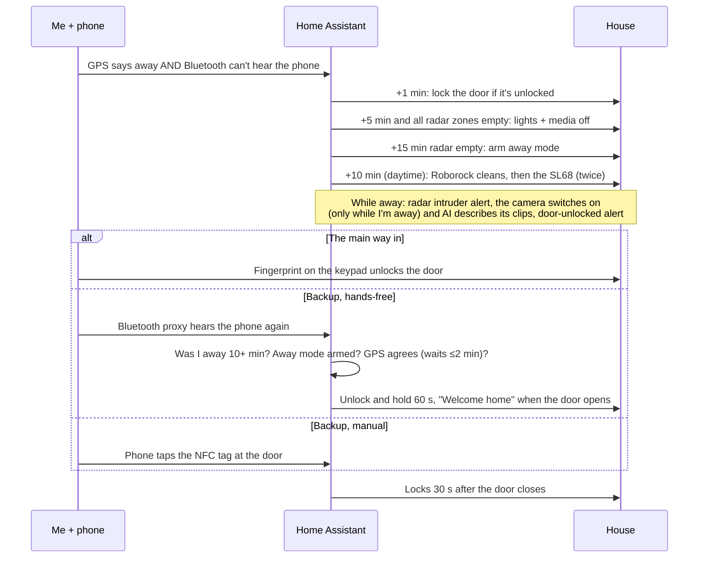

# 3 · Leaving and coming home



## Leaving
```yaml
- id: '1779331791101'
  alias: Bae Leaves Home - Away Mode
  description: Turns off lights and media when binary_sensor.bae_home (Companion app
    GPS AND Bermuda BLE agree) is away for 5 minutes. Also requires every RMM radar
    zone clear (added 2026-09-24 after a false run at 06:10 while asleep).
  triggers:
  - entity_id: binary_sensor.bae_home
    to: 'off'
    for:
      minutes: 5
    trigger: state
  conditions:
  - alias: Auto-stay is off (party mode suspends this)
    condition: state
    entity_id: input_boolean.auto_stay
    state: 'off'
  - condition: state
    entity_id: binary_sensor.bae_home
    state: 'off'
  - alias: Radar agrees the house is empty (GPS flaps and the BLE beacon sleeps overnight)
    condition: template
    value_template: '{{ expand(''binary_sensor.rmm_default_lounge_occupancy'',''binary_sensor.rmm_default_sofa_occupancy'',''binary_sensor.rmm_default_bed_occupancy'',''binary_sensor.rmm_default_bedroom_occupancy'',''binary_sensor.rmm_default_kitchen_occupancy'',''binary_sensor.rmm_default_office_occupancy'',''binary_sensor.rmm_default_bathroom_occupancy'',''binary_sensor.rmm_default_wardrobe_occupancy'')
      | selectattr(''state'',''eq'',''on'') | list | count == 0 }}'
  actions:
  - alias: Turn off all lights
    action: light.turn_off
    target:
      entity_id: all
  - alias: Pause club music if playing
    if:
    - condition: state
      entity_id: media_player.club
      state: playing
    then:
    - action: media_player.media_pause
      target:
        entity_id: media_player.club
  - alias: Turn off The Serif TV
    action: media_player.turn_off
    target:
      entity_id: media_player.the_serif_qa55ls01dawxxy
  mode: single
```

```yaml
- id: '1788110000004'
  alias: Front door · lock when I leave
  description: One minute after binary_sensor.bae_home goes off (Companion app GPS
    AND Bermuda BLE agree you left), lock up if it was left unlocked. Skipped while
    the keep-unlocked override is on.
  triggers:
  - trigger: state
    entity_id: binary_sensor.bae_home
    to: 'off'
    for: 00:01:00
  conditions:
  - alias: Auto-stay is off (party mode suspends this)
    condition: state
    entity_id: input_boolean.auto_stay
    state: 'off'
  - condition: state
    entity_id: lock.lock_pro_0fa0
    state: unlocked
  - condition: state
    entity_id: input_boolean.front_door_keep_unlocked
    state: 'off'
  actions:
  - action: lock.lock
    target:
      entity_id: lock.lock_pro_0fa0
  - action: script.turn_on
    target:
      entity_id: script.notify_bae
    data:
      variables:
        title: Front door locked
        message: You left and it was still unlocked — locked it for you.
        data:
          channel: Front door
          importance: default
          tag: front_door_away_autolock
  mode: single
```


## While I'm out
- **Robot vacuums.** Ten minutes after away mode arms (08:00–20:00, nothing cleaned in the
  last 12 hours), the Roborock does a full clean. If it finishes **cleanly** and I'm still
  out, the second robot (my old Lubluelu SL68, controlled locally with tuya-local) runs a smart
  clean, and if that also finishes without a problem, a second one. If the Roborock gets
  **stuck** instead (an error for 3 minutes mid-run: trapped, shut in a room, can't reach the
  dock), the SL68 goes out as a backup. When I'm **nearly home** (within 1 km and heading this
  way), whichever robot is out goes back to its dock. The radar automations stay paused until the
  last robot docks. If I come home mid-run anyway, I get a "send to dock" button.
- **Intruder alert.** The radar sees a person while away mode is armed and my phone isn't home:
  a push with a camera snapshot, plus a red popup on every remote until I clear it.
- **Attic camera.** The Nest camera only switches on while I'm away. Motion, person or sound on
  it: Gemini describes the clip in one sentence and I get a push with the thumbnail.
- **Door unlocked while I'm away:** high-priority alert, relocked after 60 s unless I say otherwise.

<details><summary><b>Roborock · clean while away</b> (click to expand)</summary>

```yaml
- id: '1790500000003'
  alias: Roborock · clean while away
  description: Once away mode has been on 10 min (08:00–20:00, nothing cleaned in
    the last 12 h), start a full clean. The radars see the robot as a person, so the
    radar-driven presence/sleep/guest/ghost automations are paused for the run and
    resumed when it docks or when you get home (also on HA start, as a safety net).
    Intruder + welcome-home ignore radar while binary_sensor.roborock_active is on.
    If the Roborock finishes cleanly while you're still out, script.sl68_followup_clean
    runs the SL68 (smart clean, then a second one if the first went fine) before the
    radar automations are resumed. Skipped if the robots were sent home because I'm
    nearly home (input_boolean.robots_sent_home).
  triggers:
  - trigger: state
    entity_id: input_boolean.away_mode
    to: 'on'
    for: 00:10:00
    id: away
  - trigger: state
    entity_id: vacuum.roborock_qrevo_master
    to: docked
    for: 00:02:00
    id: docked
  - trigger: state
    entity_id: input_boolean.away_mode
    to: 'off'
    id: home
  - trigger: homeassistant
    event: start
    id: start
  conditions: []
  actions:
  - choose:
    - conditions:
      - condition: trigger
        id: away
      - condition: state
        entity_id: input_boolean.auto_stay
        state: 'off'
      - condition: state
        entity_id: vacuum.roborock_qrevo_master
        state: docked
      - condition: time
        after: 08:00:00
        before: '20:00:00'
      - condition: template
        value_template: '{{ b is none or (now() - b).total_seconds() > 12*3600
          }}'
      - condition: numeric_state
        entity_id: sensor.roborock_qrevo_master_battery
        above: 60
      sequence:
      - action: automation.turn_off
        target:
          entity_id:
          - automation.rmm_kitchen_presence_light
          - automation.rmm_office_presence_light
          - automation.rmm_wardrobe_presence_light
          - automation.rmm_bedroom_presence_light
          - automation.rmm_bathroom_light_with_shower_hold
          - automation.rmm_couch_light
          - automation.rmm_console_candles
          - automation.rmm_night_path_to_bathroom
          - automation.rmm_fell_asleep_all_lights_off
          - automation.rmm_sonos_follows_you
          - automation.rmm_guest_mode_auto
          - automation.rmm_fall_alert
          - automation.rmm_ambient_day_lights
          - automation.rmm_ld2450_ghost_auto_recover
        data:
          stop_actions: true
      - action: vacuum.start
        target:
          entity_id: vacuum.roborock_qrevo_master
      - action: script.turn_on
        target:
          entity_id: script.notify_bae
        data:
          variables:
            title: Roborock
            message: You're out — started a clean. Room lights won't react to it.
            data:
              tag: roborock_away
              group: roborock
              channel: Roborock
              actions:
              - action: RR_HOME
                title: Stop & dock
    - conditions:
      - condition: trigger
        id: docked
      - condition: state
        entity_id: input_boolean.away_mode
        state: 'on'
      - condition: template
        value_template: '{{ is_state(''automation.rmm_kitchen_presence_light'',''off'')
          }}'
      sequence:
      - action: script.turn_on
        target:
          entity_id: script.notify_bae
        data:
          variables:
            title: Roborock finished
            message: Cleaned {{ states('sensor.roborock_qrevo_master_cleaning_area')
              }} m² in {{ states('sensor.roborock_qrevo_master_cleaning_time') | int(0)
              }} min.
            data:
              tag: roborock_away
              group: roborock
              channel: Roborock
      - if:
        - alias: Roborock finished cleanly, the SL68 is docked, problem-free and charged,
            and I'm not on my way home
          condition: template
          value_template: "{{ is_state('sensor.roborock_qrevo_master_vacuum_error',
            'none')\n   and is_state('sensor.roborock_qrevo_master_dock_dock_error',
            'ok')\n   and states('sensor.roborock_qrevo_master_cleaning_area') | float(0)
            > 1\n   and is_state('vacuum.sl68', 'docked')\n   and is_state('binary_sensor.sl68_problem',
            'off')\n   and states('sensor.sl68_battery') | int(0) >= 50\n   and is_state('input_boolean.robots_sent_home',
            'off') }}"
        then:
        - alias: SL68 follow-up smart cleans (that script resumes the radar automations
            when done)
          action: script.turn_on
          target:
            entity_id: script.sl68_followup_clean
        else:
        - action: script.radar_presence_resume
    - conditions:
      - condition: trigger
        id:
        - home
        - start
      sequence:
      - action: automation.turn_on
        target:
          entity_id:
          - automation.rmm_kitchen_presence_light
          - automation.rmm_office_presence_light
          - automation.rmm_wardrobe_presence_light
          - automation.rmm_bedroom_presence_light
          - automation.rmm_bathroom_light_with_shower_hold
          - automation.rmm_couch_light
          - automation.rmm_console_candles
          - automation.rmm_night_path_to_bathroom
          - automation.rmm_fell_asleep_all_lights_off
          - automation.rmm_sonos_follows_you
          - automation.rmm_guest_mode_auto
          - automation.rmm_fall_alert
          - automation.rmm_ambient_day_lights
          - automation.rmm_ld2450_ghost_auto_recover
      - if:
        - condition: trigger
          id: home
        - condition: state
          entity_id: vacuum.roborock_qrevo_master
          state:
          - cleaning
          - paused
          - returning
        then:
        - action: script.turn_on
          target:
            entity_id: script.notify_bae
          data:
            variables:
              title: Roborock is still cleaning
              message: Welcome home — it's in the {{ states('sensor.roborock_qrevo_master_current_room')
                }}.
              data:
                tag: roborock_away
                group: roborock
                channel: Roborock
                actions:
                - action: RR_HOME
                  title: Send to dock
  mode: queued
```

</details>

<details><summary><b>script.sl68_followup_clean (the second robot, twice)</b> (click to expand)</summary>

```yaml
sl68_followup_clean:
  alias: SL68 · follow-up smart cleans after the Roborock
  description: Started by "Roborock · clean while away" when the Roborock finishes
    cleanly while you're out. Runs an SL68 smart clean, and if that finishes without
    a problem, runs a second one. The radar automations stay paused until it's done,
    then radar_presence_resume turns them back on. Added 2026-10-05.
  mode: single
  icon: mdi:robot-vacuum
  sequence:
  - action: script.turn_on
    target:
      entity_id: script.notify_bae
    data:
      variables:
        title: SL68
        message: Roborock finished cleanly — SL68 starting a smart clean (1 of 2).
        data:
          tag: sl68_away
          group: roborock
          channel: Roborock
  - action: script.sl68_smart_clean_once
    response_variable: run1
    continue_on_error: true
  - variables:
      ok1: '{{ run1 is defined and run1 is mapping and run1.ok | default(false) }}'
  - action: script.sl68_smart_clean_once
    data:
      go: '{{ ok1 }}'
    response_variable: run2
    continue_on_error: true
  - variables:
      ok2: '{{ run2 is defined and run2 is mapping and run2.ok | default(false) }}'
      r1: '{{ run1.reason if run1 is defined and run1 is mapping else ''the script
        errored'' }}'
      r2: '{{ run2.reason if run2 is defined and run2 is mapping else ''the script
        errored'' }}'
      still_out: '{{ states(''vacuum.sl68'') in [''cleaning'', ''returning'', ''paused'']
        }}'
  - action: script.radar_presence_resume
    continue_on_error: true
  - action: script.turn_on
    target:
      entity_id: script.notify_bae
    data:
      variables:
        title: '{{ ''SL68 finished'' if ok1 and ok2 else ''SL68 stopped early'' }}'
        message: 'Both smart cleans finished without problems
          ({{ run1.area }} m² / {{ run1.minutes }} min, then {{ run2.area }} m² /
          {{ run2.minutes }} min). Clean 1 finished ({{ run1.area
          }} m²); clean 2 stopped: {{ r2 }}. Clean 1 stopped: {{ r1 }}.
          Skipped the second clean.'
        data:
          tag: sl68_away
          group: roborock
          channel: Roborock
          actions: '{{ [{''action'': ''RR_SL68_HOME'', ''title'': ''Send SL68 to dock''}]
            if still_out else [] }}'
```

</details>

<details><summary><b>script.sl68_smart_clean_once (returns ok/reason)</b> (click to expand)</summary>

```yaml
sl68_smart_clean_once:
  alias: SL68 · one smart clean
  description: Starts one SL68 smart clean and waits for it to dock again. Returns
    ok=true only if it started, docked again (for 2 min) and never reported a problem.
    Bails out if you're home, it isn't ready, or go is false. Used by sl68_followup_clean.
  mode: single
  icon: mdi:robot-vacuum
  fields:
    go:
      description: Set false to skip this run (returns ok=false straight away).
      default: true
      selector:
        boolean: {}
  sequence:
  - if: '{{ go is defined and not go }}'
    then:
    - variables:
        result:
          ok: false
          reason: skipped because the first clean didn't finish cleanly
    - stop: Skipped
      response_variable: result
  - if:
    - condition: template
      value_template: "{{ not is_state('input_boolean.away_mode', 'on')\n   or not
        is_state('vacuum.sl68', 'docked')\n   or not is_state('binary_sensor.sl68_problem',
        'off')\n   or states('sensor.sl68_battery') | int(0) < 50 }}"
    then:
    - variables:
        result:
          ok: false
          reason: 'you
            came home it is reporting a problem it was {{ states(''vacuum.sl68'') }}, not docked its battery
            was only {{ states(''sensor.sl68_battery'') }}%'
    - stop: SL68 not ready
      response_variable: result
  - action: vacuum.send_command
    target:
      entity_id: vacuum.sl68
    data:
      command: smart
  - alias: Confirm it actually left the dock
    wait_for_trigger:
    - trigger: state
      entity_id: vacuum.sl68
      from: docked
    timeout: 00:02:00
    continue_on_timeout: true
  - if: '{{ wait.trigger is none }}'
    then:
    - variables:
        result:
          ok: false
          reason: it didn't start (still {{ states('vacuum.sl68') }})
    - stop: SL68 did not start
      response_variable: result
  - wait_for_trigger:
    - trigger: state
      entity_id: vacuum.sl68
      to: docked
      for: 00:02:00
      id: docked
    - trigger: state
      entity_id: binary_sensor.sl68_problem
      to: 'on'
      id: problem
    - trigger: state
      entity_id: vacuum.sl68
      to: error
      id: error
    - trigger: state
      entity_id: input_boolean.away_mode
      to: 'off'
      id: home
    timeout: 03:00:00
    continue_on_timeout: true
  - variables:
      how: '{{ wait.trigger.id if wait.trigger else ''timeout'' }}'
      result:
        ok: '{{ how == ''docked'' and is_state(''binary_sensor.sl68_problem'', ''off'')
          }}'
        reason: "{{ {'docked': 'finished', 'problem': 'it reported a problem', 'error':
          'it hit an error',\n    'home': 'you came home', 'timeout': 'it was still
          going after 3 h'}[how] }}"
        area: '{{ states(''sensor.sl68_cleaning_area'') }}'
        minutes: '{{ states(''sensor.sl68_cleaning_time'') }}'
  - stop: SL68 smart clean ended
    response_variable: result
```

</details>

<details><summary><b>SL68 · backup when the Roborock gets stuck</b> (click to expand)</summary>

```yaml
- id: '1791000000002'
  alias: SL68 · backup when the Roborock gets stuck
  description: If the Roborock stops with an error for 3 minutes in the middle of
    an away-mode clean (stuck, trapped, shut in a room, can't get back to the dock),
    send the SL68 out for one smart clean as a backup and tell me how it went. The
    radar automations stay paused until I get home, because the stuck Roborock is
    still out. Added by Claude 2026-10-06.
  triggers:
  - trigger: state
    entity_id: vacuum.roborock_qrevo_master
    to: error
    for: 00:03:00
  - trigger: state
    entity_id: sensor.roborock_qrevo_master_vacuum_error
    to:
    - lidar_blocked
    - bumper_stuck
    - wheels_suspended
    - cliff_sensor_error
    - main_brush_jammed
    - side_brush_jammed
    - wheels_jammed
    - robot_trapped
    - robot_tilted
    - side_brush_error
    - fan_error
    - vertical_bumper_pressed
    - dock_locator_error
    - return_to_dock_fail
    - nogo_zone_detected
    - vibrarise_jammed
    - robot_on_carpet
    - invisible_wall_detected
    - cannot_cross_carpet
    - compass_error
    - optical_flow_sensor_dirt
    - wall_sensor_dirty
    - filter_blocked
    - no_dustbin
    - internal_error
    for: 00:03:00
  conditions:
  - alias: Stopped away from the dock
    condition: state
    entity_id: vacuum.roborock_qrevo_master
    state:
    - error
    - idle
    - paused
  - condition: state
    entity_id: input_boolean.away_mode
    state: 'on'
  - condition: state
    entity_id: input_boolean.auto_stay
    state: 'off'
  - condition: state
    entity_id: input_boolean.robots_sent_home
    state: 'off'
  - alias: An away-mode clean is running (Roborock · clean while away paused the radar
      automations)
    condition: state
    entity_id: automation.rmm_kitchen_presence_light
    state: 'off'
  - condition: state
    entity_id:
    - script.sl68_followup_clean
    - script.sl68_smart_clean_once
    state: 'off'
  actions:
  - variables:
      err: '{{ states(''sensor.roborock_qrevo_master_vacuum_error'') | replace(''_'',
        '' '') }}'
      room: '{{ states(''sensor.roborock_qrevo_master_current_room'') }}'
  - action: script.turn_on
    target:
      entity_id: script.notify_bae
    data:
      variables:
        title: Roborock is stuck
        message: It reports {{ err }}{{ ' in the ' ~ room if room not in ['unknown',
          'unavailable', ''] else '' }}, so the SL68 is going out as a backup.
        data:
          tag: roborock_stuck
          group: roborock
          channel: Roborock
  - action: script.sl68_smart_clean_once
    data:
      go: true
    response_variable: sl68
  - action: script.turn_on
    target:
      entity_id: script.notify_bae
    data:
      variables:
        title: SL68 backup clean
        message: 'Done: {{ sl68.area }} m² in {{ sl68.minutes }} min.
          The Roborock still needs rescuing.It didn''t finish: {{ sl68.reason
          }}.'
        data:
          tag: roborock_stuck
          group: roborock
          channel: Roborock
  mode: single
  max_exceeded: silent
```

</details>

<details><summary><b>Robots · dock when I'm nearly home</b> (click to expand)</summary>

```yaml
- id: '1791000000001'
  alias: Robots · dock when I'm nearly home
  description: 'While away mode is on and I''m within 1 km of home and heading towards
    it (Proximity: sensor.home_bae_distance / direction_of_travel), send whichever
    robot is out back to its dock and stop the SL68 follow-up/backup cleans. Sets
    input_boolean.robots_sent_home so the SL68 doesn''t start after the Roborock docks
    (clears whenever away mode changes). Added by Claude 2026-10-06.'
  triggers:
  - trigger: numeric_state
    entity_id: sensor.home_bae_distance
    below: 1000
    id: near
  - trigger: state
    entity_id: sensor.home_bae_direction_of_travel
    to: towards
    id: near
  - trigger: state
    entity_id: input_boolean.away_mode
    id: reset
  conditions: []
  actions:
  - choose:
    - conditions:
      - condition: trigger
        id: reset
      sequence:
      - action: input_boolean.turn_off
        target:
          entity_id: input_boolean.robots_sent_home
    - conditions:
      - condition: trigger
        id: near
      - condition: state
        entity_id: input_boolean.away_mode
        state: 'on'
      - condition: state
        entity_id: input_boolean.robots_sent_home
        state: 'off'
      - condition: numeric_state
        entity_id: sensor.home_bae_distance
        below: 1000
      - condition: state
        entity_id: sensor.home_bae_direction_of_travel
        state: towards
      sequence:
      - action: input_boolean.turn_on
        target:
          entity_id: input_boolean.robots_sent_home
      - alias: Stop the SL68 follow-up/backup chain so it does not start another run
        action: script.turn_off
        target:
          entity_id:
          - script.sl68_followup_clean
          - script.sl68_smart_clean_once
      - variables:
          out: '{{ [''vacuum.roborock_qrevo_master'', ''vacuum.sl68''] | select(''is_state'',
            [''cleaning'', ''paused'', ''returning'']) | list }}'
      - if:
        - condition: template
          value_template: '{{ out | count > 0 }}'
        then:
        - action: vacuum.return_to_base
          target:
            entity_id: '{{ out }}'
        - action: script.turn_on
          target:
            entity_id: script.notify_bae
          data:
            variables:
              title: Robots heading home
              message: Looks like you're nearly home, so {{ out | map('state_attr',
                'friendly_name') | join(' and ') }} {{ 'is' if out | count == 1 else
                'are' }} going back to the dock.
              data:
                tag: roborock_away
                group: roborock
                channel: Roborock
  mode: queued
  max: 5
```

</details>

<details><summary><b>RMM: Intruder alert</b> (click to expand)</summary>

```yaml
- id: '1785400000014'
  alias: 'RMM: Intruder alert'
  description: Radar sees a person while away mode is armed and neither person.bae
    nor the Razr is home -> push alert with camera snapshot. pixel_6a excluded (always
    home).
  triggers:
  - trigger: numeric_state
    entity_id: sensor.rmm_default_master
    above: 0
    for: 00:01:00
  conditions:
  - condition: state
    entity_id: input_boolean.away_mode
    state: 'on'
  - condition: state
    entity_id: binary_sensor.bae_home
    state: 'off'
  - condition: not
    conditions:
    - condition: state
      entity_id: device_tracker.motorola_razr_50
      state: home
  - alias: Not just the Roborock (unless a door moved in the last 10 min)
    condition: template
    value_template: '{{ is_state(''binary_sensor.roborock_active'',''off'') or (now()
      - states.binary_sensor.ikea_of_sweden_parasoll_door_window_sensor.last_changed).total_seconds()
      < 600 or (now() - states.lock.lock_pro_0fa0.last_changed).total_seconds() <
      600 }}'
  actions:
  - action: input_boolean.turn_on
    target:
      entity_id: input_boolean.intruder_alert_active
  - action: script.turn_on
    target:
      entity_id: script.notify_bae
    data:
      variables:
        title: Intruder?
        message: Radar sees {{ states('sensor.rmm_default_master') }} person(s) in
          the flat while away mode is armed.
        data:
          ttl: 0
          priority: high
    continue_on_error: true
  - action: persistent_notification.create
    data:
      title: Intruder alert
      message: Radar occupancy while away at {{ now().strftime('%H:%M:%S') }}.
      notification_id: rmm_intruder
  mode: single
```

</details>


## Coming home: fingerprint first, with backups
I let myself in with a fingerprint on the keypad. Home Assistant backs that up in the background:
if the Bluetooth proxies hear my phone after a real absence and GPS agrees, it unlocks the door
hands-free for 60 seconds (below); NFC tags at the door are a manual fallback; and the automations
further down make sure the door always ends up locked again.

<details><summary><b>Front door · BLE arrival unlock + welcome</b> (click to expand)</summary>

```yaml
- id: '1788110000012'
  alias: Front door · BLE arrival unlock + welcome
  description: 'When a Bermuda proxy spots the Razr after it has been away for 10+
    minutes, AND RMM away mode was armed (on, or disarmed <10 min ago — blocks false
    ''arrivals'' when the phone''s beacon sleeps overnight) AND the Companion app
    GPS also says home (waits up to 2 min for GPS — BLE alone is spoofable), unlocks
    and holds the door for 60s. If the door opens: says ''Welcome home, Bay'' on the
    Club Sonos and hands back to the normal auto-lock (locks 30s after it closes).
    If nobody opens it within 60s: relocks.'
  triggers:
  - trigger: state
    entity_id: device_tracker.bermuda_razr_bermuda_tracker
    from: not_home
    to: home
  conditions:
  - alias: Auto-stay is off (party mode suspends this)
    condition: state
    entity_id: input_boolean.auto_stay
    state: 'off'
  - alias: 'Away mode was really armed (radar-confirmed empty house): still on, or
      disarmed within the last 10 min by the arrival'
    condition: template
    value_template: '{{ is_state(''input_boolean.away_mode'',''on'') or (is_state(''input_boolean.away_mode'',''off'')
      and (now() - states.input_boolean.away_mode.last_changed).total_seconds() <
      600) }}'
  - alias: Was away for at least 10 minutes
    condition: template
    value_template: '{{ (trigger.to_state.last_changed - trigger.from_state.last_changed).total_seconds()
      >= 600 }}'
  - condition: state
    entity_id: lock.lock_pro_0fa0
    state: locked
  - condition: state
    entity_id: input_boolean.front_door_keep_unlocked
    state: 'off'
  actions:
  - alias: 'Second factor: Companion GPS must agree (up to 2 min)'
    wait_template: '{{ is_state(''device_tracker.motorola_razr_50'', ''home'') }}'
    timeout: 00:02:00
    continue_on_timeout: false
  - action: input_boolean.turn_on
    target:
      entity_id: input_boolean.front_door_unlock_hold
  - action: lock.unlock
    target:
      entity_id: lock.lock_pro_0fa0
  - wait_for_trigger:
    - trigger: state
      entity_id: binary_sensor.front_door_open
      to: 'on'
    timeout: 00:01:00
    continue_on_timeout: true
  - action: input_boolean.turn_off
    target:
      entity_id: input_boolean.front_door_unlock_hold
  - if:
    - condition: template
      value_template: '{{ wait.trigger is not none }}'
    then:
    - action: media_player.play_media
      target:
        entity_id: media_player.club
      data:
        media_content_type: music
        media_content_id: media-source://tts/tts.home_assistant_cloud?message=Welcome%20home%2C%20Bay.
        announce: true
        extra:
          volume: 25
    else:
    - alias: Nobody came in — relock
      if:
      - condition: state
        entity_id: lock.lock_pro_0fa0
        state: unlocked
      - condition: not
        conditions:
        - condition: state
          entity_id: binary_sensor.front_door_open
          state: 'on'
      then:
      - action: lock.lock
        target:
          entity_id: lock.lock_pro_0fa0
  mode: single
  max_exceeded: silent
```

</details>


Why so many conditions? **Bluetooth alone can be spoofed and phone beacons sleep overnight**,
so a "new" Bluetooth sighting at 3 am isn't an arrival. Requiring away mode to have been
armed, plus GPS agreement, makes the backup auto-unlock both safe and boring. NFC tags at the door
(only my phone counts) are the manual fallback.

## The front door, belt and braces
The lock is a SwitchBot Lock Pro with a fingerprint keypad and a separate Zigbee contact sensor.
Thirteen small automations keep it honest in the background:

- **Auto-lock** 30 s after the door closes. If the sensor is offline, a blind 45 s timer.
- A **10-minute backstop** and a **3-hourly sweep** (silenced overnight).
- **Re-throw the bolt** after the inside handle or a key retracts it mechanically (the lock
  doesn't notice, so it would keep reporting "locked").
- **Sensors disagree:** if the contact sensor and the lock's own door sensor disagree for
  10 minutes, one of them is stuck, so tell me.
- A **keep-unlocked override** for parties and deliveries, with a reminder every 3 hours.
- Every lock/unlock is announced over whatever the Sonos is playing (ducking the music),
  except overnight, and pushed to my phone on a quiet channel that replaces itself.
- A safety net clears stuck suppression flags after a restart.

All of them are in [`config/automations.yaml`](../config/automations.yaml) under "Front door ·".

---
[← Back to the overview](../README.md)
