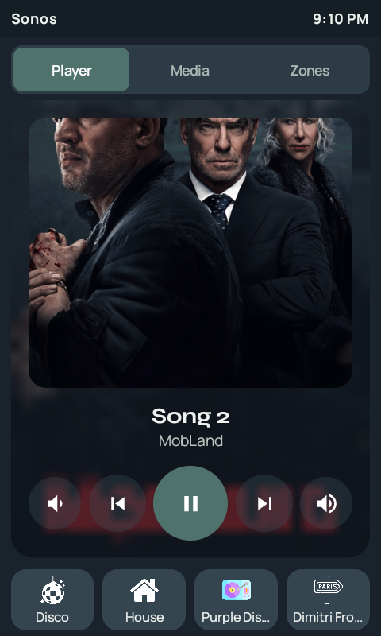
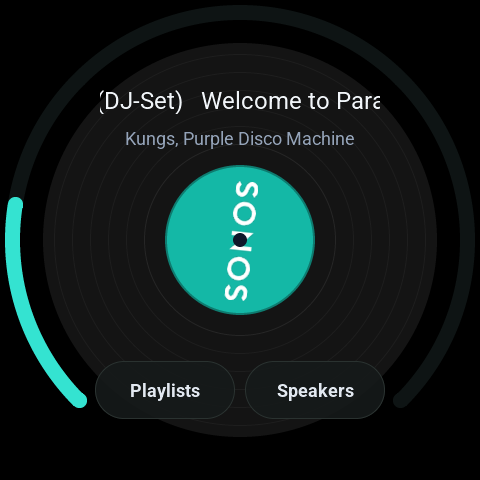
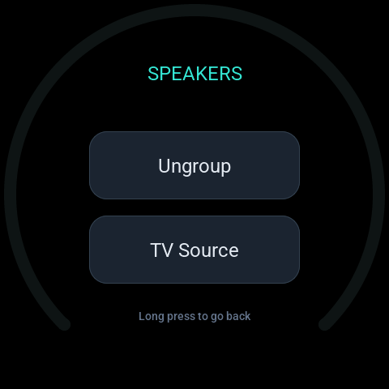

# 6 · Media: Sonos, TV and Plex without thinking about it

- **Sonos everywhere:** a Beam in the lounge (with two Play:3s bonded to it), plus
  bedroom, bathroom and office speakers. Music Assistant plays my local library (on the NAS)
  and Spotify.
- **Music follows me** (optional toggle): walking into a room joins that room's speaker to the
  lounge, and five minutes after the room empties it leaves the group. Each room keeps its
  own volume.
- **TV audio:** when the TV is actually playing *and* the Sonos can hear it over HDMI, the
  Sonos switches to TV. Unplugging the HDMI keeps the music.
- **Plex hygiene:** a Plex session left paused on the TV reports its position four times a
  second all day, so it's stopped after 5 minutes (Plex keeps the resume point).
- **Night sound** on the TV speaker from 8 pm to 8 am.
- **Club Lights:** when the lounge plays from Music Assistant and party lights are on, a
  beat-sync player on my mini-PC joins the group and drives the lights.

| Remote: TV + Plex | Remote: Sonos | Knob: media | Knob: speakers |
|---|---|---|---|
|  |  |  |  |

<details><summary><b>RMM: Sonos follows you</b> (click to expand)</summary>

```yaml
- id: '1785400000010'
  alias: 'RMM: Sonos follows you'
  description: 'Music follows occupancy: entering a zone joins that room''s Sonos
    to the Club; zone empty 5 min un-joins it. Created by Claude 2026-07-25. 2026-09-26:
    no longer copies the Club''s volume on join - each room keeps its own level (capped
    to 20 each morning by ''RMM: Sonos morning volume reset''). Speaker actions are
    guarded on availability. 2026-09-27: joins only when input_boolean.music_follows_me
    is on (un-join always runs).'
  triggers:
  - trigger: state
    entity_id: binary_sensor.rmm_default_bedroom_occupancy
    to: 'on'
    id: bedroom_on
  - trigger: state
    entity_id: binary_sensor.rmm_default_bedroom_occupancy
    to: 'off'
    for: 00:05:00
    id: bedroom_off
  - trigger: state
    entity_id: binary_sensor.rmm_default_office_occupancy
    to: 'on'
    id: office_on
  - trigger: state
    entity_id: binary_sensor.rmm_default_office_occupancy
    to: 'off'
    for: 00:05:00
    id: office_off
  - trigger: state
    entity_id: binary_sensor.rmm_default_bathroom_occupancy
    to: 'on'
    id: bathroom_on
  - trigger: state
    entity_id: binary_sensor.rmm_default_bathroom_occupancy
    to: 'off'
    for: 00:05:00
    id: bathroom_off
  conditions:
  - alias: 'Guest mode off - OR auto-stay on (party: keep following me)'
    condition: or
    conditions:
    - condition: state
      entity_id: input_boolean.guest_mode
      state: 'off'
    - condition: state
      entity_id: input_boolean.auto_stay
      state: 'on'
  actions:
  - choose:
    - alias: Entered the zone - join the Club, leave the room's own volume alone
      conditions:
      - condition: state
        entity_id: input_boolean.music_follows_me
        state: 'on'
      - condition: template
        value_template: '{{ edge == ''on'' }}'
      - condition: state
        entity_id: media_player.club
        state: playing
      - condition: template
        value_template: '{{ states(speaker) not in [''unavailable'', ''unknown'']
          }}'
      sequence:
      - action: media_player.join
        target:
          entity_id: media_player.club
        data:
          group_members:
          - '{{ speaker }}'
    - alias: Zone empty 5 min - un-join, but only if it is actually in the Club group
      conditions:
      - condition: template
        value_template: '{{ edge == ''off'' }}'
      - condition: template
        value_template: '{{ states(speaker) not in [''unavailable'', ''unknown'']
          }}'
      - condition: template
        value_template: '{{ speaker in (state_attr(''media_player.club'', ''group_members'')
          or []) }}'
      sequence:
      - action: media_player.unjoin
        target:
          entity_id: '{{ speaker }}'
  variables:
    speakers:
      bedroom: media_player.bedroom_sonos
      office: media_player.office_sonos
      bathroom: media_player.bathroom_sonos
    room: '{{ trigger.id.split(''_'')[0] }}'
    edge: '{{ trigger.id.split(''_'')[1] }}'
    speaker: '{{ speakers[room] }}'
  mode: queued
  max: 10
```

</details>

<details><summary><b>Club · Sonos plays the TV when the TV is playing</b> (click to expand)</summary>

```yaml
- id: astrion_club_sonos_follows_tv
  alias: Club · Sonos plays the TV when the TV is playing
  description: Created for the Astrion remotes (D1). Only when the Sonos can actually
    hear the TV over HDMI, so unplugging the Sonos HDMI keeps the music. Hold SCENE
    stays as the manual way.
  triggers:
  - trigger: state
    entity_id:
    - media_player.the_club_tv
    - media_player.club_android_tv_10_0_0_248_club_tv
    to: playing
    for:
      seconds: 5
  - trigger: state
    entity_id: sensor.club_audio_input_format
  conditions:
  - alias: Something is playing on the TV
    condition: template
    value_template: '{{ is_state(''media_player.the_club_tv'',''playing'') or is_state(''media_player.club_android_tv_10_0_0_248_club_tv'',''playing'')
      }}'
  - alias: The Sonos can hear the TV (HDMI connected, audio present)
    condition: template
    value_template: '{{ (states(''sensor.club_audio_input_format'') | lower) not in
      [''no input'',''no input connected'',''no audio'',''pcm 2.0 no audio'',''unavailable'',''unknown'','''']
      and ''no audio'' not in (states(''sensor.club_audio_input_format'') | lower)
      }}'
  - alias: Not already on the TV
    condition: template
    value_template: '{{ state_attr(''media_player.club'',''source'') != ''TV'' }}'
  actions:
  - action: media_player.select_source
    target:
      entity_id: media_player.club
    data:
      source: TV
  - variables:
      others: '{{ (state_attr(''media_player.club'',''group_members'') or []) | reject(''eq'',''media_player.club'')
        | list }}'
  - if:
    - condition: template
      value_template: '{{ others | count > 0 }}'
    then:
    - action: media_player.unjoin
      target:
        entity_id: '{{ others }}'
  mode: single
```

</details>


---
[← Back to the overview](../README.md)
