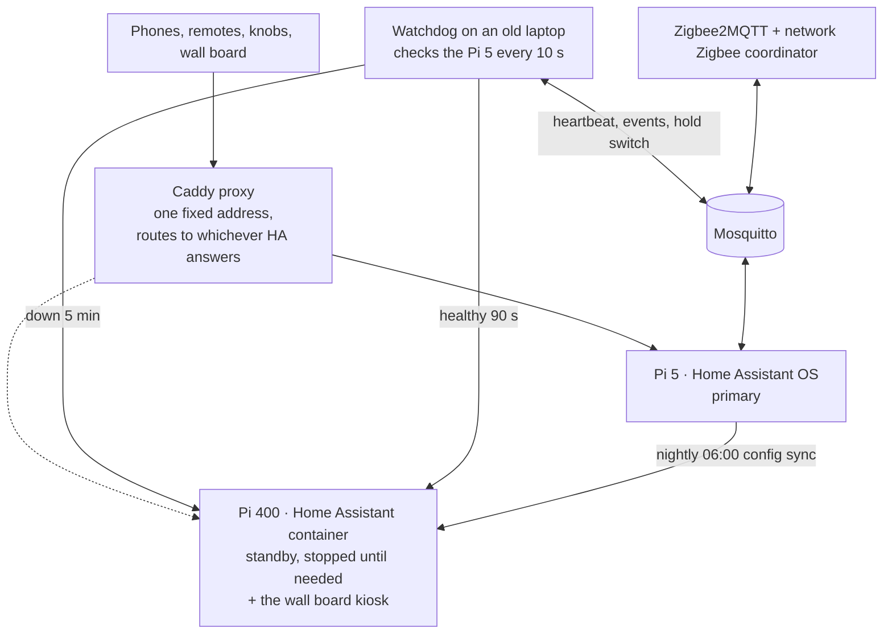

# 8 · Failover: the wall calendar is also a spare brain

The main Home Assistant runs on a **Raspberry Pi 5** (Home Assistant OS, data on a USB drive).
If it dies, an old **Raspberry Pi 400**, the same box that drives the kitchen wall board,
takes over within about five minutes, and gives the house back when the Pi 5 recovers.



**How it works**
- A small watchdog (a bash script under systemd) on the old laptop checks the Pi 5 every 10 s.
- After **5 minutes** down it SSHes to the Pi 400 with a key that can run *only* the failover
  control script, from *only* the laptop. The Pi 400 then checks **independently** that it can't
  reach the Pi 5 before starting Home Assistant. That two-sided check prevents a split brain.
- The Caddy proxy (`lb_policy first`) automatically routes to whichever instance answers, so no
  phone, remote or DNS change is needed.
- When the Pi 5 has been healthy for **90 s**, the standby is shut down again. Demotion is never
  paused: two live copies would double-fire every automation.
- A **nightly sync** copies the Pi 5's config to the Pi 400, pins the same HA version, strips
  the Supervisor-only integration (which breaks USB and Bluetooth on a container install), and
  skips while the standby is live.
- The watchdog publishes a heartbeat, events and a **hold** switch over MQTT, so Home Assistant
  can pause failover during planned maintenance and push "failed over / back on the Pi 5" to my phone.
- Zigbee runs on an external Zigbee2MQTT and a network Zigbee coordinator, so **both** instances
  can control Zigbee devices. Wi-Fi, cloud and ESPHome devices also work from either.

A real drill (`ha core stop` on the Pi 5): the standby was serving through the proxy 31
seconds after promotion, and failback was fully automatic once the Pi 5 came back.

<details><summary><b>Failover · notify on switchover</b> (click to expand)</summary>

```yaml
- id: '1789500000002'
  alias: Failover · notify on switchover
  description: 'Pushes events from baelap''s failover watchdog (/srv/ha-failover)
    to the phone: failed over to the Pi400, back on the Pi5, or failover blocked.
    Lives in both instances via the nightly sync, so whichever HA is live sends it.
    Added by Claude 2026-09-23.'
  triggers:
  - trigger: mqtt
    topic: ha-failover/event
  conditions: []
  actions:
  - action: script.turn_on
    target:
      entity_id: script.notify_bae
    data:
      variables:
        title: '{{ trigger.payload_json.title }}'
        message: '{{ trigger.payload_json.message }}'
        data:
          channel: Failover
          importance: high
          tag: ha_failover
  - action: persistent_notification.create
    data:
      title: '{{ trigger.payload_json.title }}'
      message: '{{ trigger.payload_json.message }} ({{ now().strftime(''%a %H:%M'')
        }})'
      notification_id: ha_failover_event
  mode: queued
```

</details>


## Other infrastructure
- **Old HP EliteBook laptop (baelap):** my own local private cloud, plus Mosquitto, Zigbee2MQTT, the
  Caddy proxy, the failover watchdog and the nightly news-digest job.
- **NAS (an end-of-life QNAP, now running Unraid):** Plex, the music library, backups, and the news digest web server.
- **Backups:** daily, 3 copies kept, to the Pi, the NAS and Home Assistant Cloud.

---
[← Back to the overview](../README.md)
